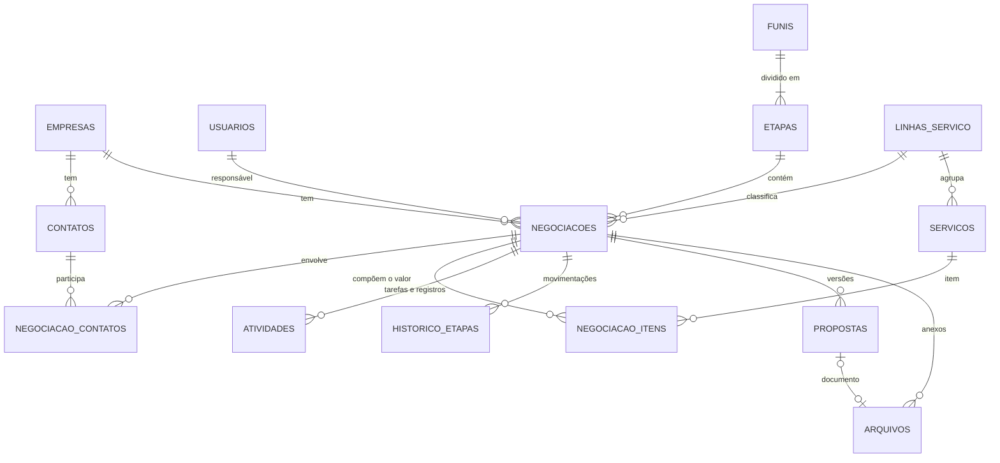

# CRM Kepha — Estrutura e pontos para validação

Proposta de estrutura para o CRM interno da Kepha, **antes de qualquer desenvolvimento**. Serve para validar com o time como cada funcionalidade vai funcionar e para fechar as decisões que mudam o desenho do backend.

**Base**: print do quadro de Negociações do CRM usado hoje (05/10/2026) · contexto dos projetos da Kepha registrado neste repositório (`docs/handoff.md`).
**Estado**: nada decidido. Toda regra abaixo é proposta. As perguntas da seção 9 marcadas como **bloqueantes** mudam o modelo de dados e precisam de resposta antes do primeiro código.

> **Onde este documento vai morar.** O CRM é um produto diferente do gerador de escalas e deve ter repositório próprio. Este arquivo fica aqui só até esse repositório existir.

---

## 1. O que o print mostra sobre o uso atual

Antes de desenhar o novo, vale ler o que o atual revela. Cada linha vira requisito.

| # | Observação no print | O que significa | Consequência no CRM novo |
| --- | --- | --- | --- |
| O1 | 22 negociações abertas. Só a etapa "Negociando" tem valor (R$ 112.759,99), e mesmo nela há cards sem valor (Mobiis, Grupo Plátano). As outras etapas somam R$ 0,00. | O valor só aparece no fim do funil. Previsão de receita não existe hoje. | Valor estimado obrigatório a partir de uma etapa (portão, R3) e previsão ponderada pela probabilidade da etapa. |
| O2 | **Nenhum dos 21 cards visíveis tem tarefa com data futura.** 15 não têm tarefa ("Criar Tarefa") e 5 têm tarefa vencida: 03/06, 08/06, 27/08, 23/09 e 25/09. A mais antiga está parada há quatro meses. | O próximo passo não é registrado, ou é registrado e não é baixado. O CRM vira foto do passado. | Regra do próximo passo (R1) e de negociação parada (R2). **É o ponto mais importante do sistema.** |
| O3 | A mesma empresa aparece duas vezes com nomes diferentes: "ELITE LOCACOES DE PLATAFORMAS E EQUIPAMENT…" (Alinhamento) e "Elite Locações Ltda" (Negociando), ambas com "Captação Recursos Fomento - Giro Fácil". | Empresa duplicada no cadastro, e possivelmente negociação duplicada também. | CNPJ como chave única, consulta automática aos dados públicos e aviso de nome parecido (R5). |
| O4 | Pluma Agroavícola tem 3 negociações abertas: inovação/BRDE, ISO e captação. | Um cliente com várias frentes ao mesmo tempo. | Página da empresa com todas as negociações, contatos e histórico consolidados. |
| O5 | O tipo de serviço está escrito no título: "Captação de Recursos", "IA", "Implementação de ISO", "LGPD", "Desenvolvimento Software", "Consultoria Sebrae". A grafia varia ("Captação", "Capitação", "captacao"). | Não dá para filtrar nem medir por linha de serviço. | Campo estruturado **Linha de serviço**, com título sugerido automaticamente (R6). |
| O6 | Há valor único (R$ 29.900,00) e valor recorrente (R$ 71.880,00). Há também R$ 999,99, que parece valor de preenchimento. | Mais de um modelo de cobrança. | Itens da negociação com tipo de cobrança, incluindo êxito para captação de recursos (P3). |
| O7 | Qualificação em estrelas = 1 em todos os cards. | Campo não usado. | Remover, ou trocar por algo que o time preencha de fato (P12). |
| O8 | Etiqueta "Nova" × "Em andamento" nos cards. | Significado não está claro. | Definir ou remover (P12). |
| O9 | A primeira etapa é "Lista Sem Contato": empresas-alvo ainda não abordadas. | A prospecção está dentro do funil. | Manter como etapa ou separar (P4). |
| O10 | "IA em órgão público — Prefeitura de Cambé". | Cliente do setor público, com rito de contratação próprio (dispensa, licitação). | Possível funil próprio (P4). |
| O11 | "Gerador de Escalas — Grupo CRK" em Alinhamento. A proposta desse projeto saiu em .docx a partir do modelo da Kepha, em duas versões (V1.0 e V1.1). | Propostas são documentos versionados. | Propostas versionadas por negociação (R7). Gerar a partir do modelo fica para a fase 2. |
| O12 | O CRM atual tem "Priorizar negociações", "IA para Negociações" e rastreio de leitura de e-mail ("O e-mail foi lido"). | Recursos que o time pode estar usando, ou não. | Saber o que é usado de fato antes de replicar (P6, P11). |

---

## 2. Princípios de desenho

1. **Dimensionado para a Kepha, não para um SaaS.** São dezenas de negociações abertas e um time pequeno. Um único serviço (monólito modular) com PostgreSQL resolve tudo: busca, fila de tarefas agendadas e relatórios. Sem microsserviços, Redis ou Elasticsearch, porque cada peça a mais é algo a manter.
2. **O sistema cobra atualização.** CRM desatualizado é pior do que nenhum, porque dá falsa segurança (O2). As regras de próximo passo e de negociação parada são centrais, não acessórias.
3. **Histórico desde o primeiro dia.** Conversão por etapa, tempo em cada etapa e ciclo de venda dependem de registrar cada movimentação no momento em que acontece. Isso não se reconstrói depois.
4. **A empresa é a âncora; a negociação é a oportunidade.** Uma empresa (CNPJ) tem vários contatos e várias negociações ao longo do tempo (O4).
5. **Nada se apaga de verdade.** Exclusão lógica e trilha de auditoria. Perder uma negociação é um status, não uma exclusão.

---

## 3. Modelo de dados

### 3.1 Visão geral



### 3.2 Entidades centrais

#### empresas

| Campo | Observação |
| --- | --- |
| `cnpj` | Único quando preenchido, com validação dos dígitos. Opcional para quem ainda não tem CNPJ conhecido, pessoa física ou empresa estrangeira. |
| `razao_social`, `nome_fantasia` | Preenchidos pela consulta de CNPJ. O fantasia é editável. |
| `cnae_principal`, `porte`, `cidade`, `uf`, `site`, `linkedin` | Os quatro primeiros vêm da consulta. |
| `setor_publico` | Derivado da natureza jurídica do CNPJ (grupo 1 = administração pública). Muda o rito de contratação (O10). |
| `papeis` | Marcações manuais: parceiro, órgão de fomento, fornecedor. |
| `responsavel_id` | Dono da conta. |

A situação comercial (prospect, cliente, ex-cliente) **é calculada** a partir das negociações, não digitada. Assim não fica desatualizada.

#### contatos

| Campo | Observação |
| --- | --- |
| `nome`, `cargo` | |
| `email` | Aviso de duplicidade quando já existe. |
| `telefone`, `whatsapp` | Formato internacional, com link que abre a conversa. |
| `empresa_id` | Empresa atual. |
| `base_legal` | LGPD; legítimo interesse por padrão (ver 5.4). |

A ligação com a negociação fica em `negociacao_contatos`, com o papel do contato naquela venda (decisor, influenciador, técnico, financeiro) e qual é o principal.

#### funis e etapas

`etapas` guarda, além de nome e ordem:

- `probabilidade` — % usada na previsão ponderada;
- `dias_limite` — prazo para a negociação ser sinalizada como parada (R2);
- `campos_obrigatorios` — o portão de entrada da etapa (R3).

Tudo configurável pelo admin, sem mexer em código.

#### negociacoes

| Campo | Observação |
| --- | --- |
| `titulo` | Sugerido como "Linha de serviço — Empresa", editável (R6). |
| `empresa_id`, `funil_id`, `etapa_id`, `responsavel_id` | Obrigatórios. |
| `linha_servico_id` | Obrigatório. Resolve O5. |
| `status` | aberta · ganha · perdida. |
| `origem_id`, `parceiro_indicador_id` | Como chegou e quem indicou (ex.: Grupo CRK). |
| `previsao_fechamento`, `probabilidade` | A probabilidade herda da etapa e pode ser ajustada. |
| `valor_estimado` | Número único para as etapas iniciais, antes de existir composição por itens. |
| totais por tipo de cobrança | Calculados dos itens (único, recorrente mensal, êxito estimado). |
| `motivo_perda_id`, `detalhe_perda`, `concorrente` | Obrigatório ao perder. |
| `ganha_em`, `perdida_em` | |
| `etapa_desde`, `ultima_atividade_em`, `proxima_atividade_id` | Ver a nota abaixo. |
| `versao` | Controle de concorrência: duas pessoas editando o mesmo card. |

`etapa_desde`, `ultima_atividade_em`, `proxima_atividade_id` e os totais são **copiados de propósito** para a própria negociação. O quadro mostra esses dados em todos os cards. Guardá-los ali evita uma consulta por card. A camada de serviço os atualiza na mesma transação da mudança que os afeta.

#### negociacao_itens

`servico_id`, `descricao`, `tipo_cobranca`, `quantidade`, `valor_unitario` e `desconto`. Os tipos de cobrança são:

- **único** — projeto, implantação;
- **recorrente mensal** — com número de meses;
- **êxito** — percentual sobre uma base (ex.: 5% sobre R$ 2 milhões a captar);
- **hora**.

A lista depende da resposta à P3.

#### atividades — tarefas e registros numa tabela só

| Campo | Observação |
| --- | --- |
| `tipo` | tarefa · ligação · reunião · e-mail · WhatsApp · visita · nota |
| `titulo`, `descricao` | |
| `agendada_para` | Data e hora. Vazio em nota. |
| `concluida_em`, `resultado` | O que aconteceu. |
| `responsavel_id` | |
| `negociacao_id`, `empresa_id`, `contato_id` | Pelo menos um preenchido. |
| `origem`, `id_externo` | manual · e-mail · agenda. O id externo evita duplicar na sincronização da fase 2. |

- **Por que uma tabela só.** A linha do tempo da negociação e a lista "minhas tarefas de hoje" saem de uma consulta cada. Uma tarefa concluída vira registro sem mudar de tabela.
- **Por que chaves explícitas, e não o par genérico "tipo de entidade + id".** O banco garante a integridade: não existe atividade apontando para negociação inexistente.

#### historico_etapas

Colunas: `negociacao_id`, etapa de origem → etapa de destino, status de origem → status de destino, `movido_por` e `movido_em`.

É gravado na mesma transação de **toda** mudança de etapa ou de status, inclusive ganhar, perder e reabrir. É a fonte de todos os relatórios de conversão e tempo (R11).

#### auditoria

Colunas: `entidade`, `entidade_id`, `acao`, `alteracoes` (JSON com o antes e o depois de cada campo), `usuario_id` e `em`.

Responde perguntas como "quem mudou o valor desta negociação e quando".

### 3.3 Demais tabelas

| Tabela | Conteúdo |
| --- | --- |
| `propostas` | Negociação, versão (1.0, 1.1…), status (rascunho · enviada · aceita · recusada · expirada), valor total, validade, data de envio, arquivo. |
| `arquivos` | Nome, tipo, tamanho, chave no armazenamento, vínculo (negociação ou empresa), quem enviou. |
| `linhas_servico`, `servicos` | Catálogo. Lista inicial a partir do print: Captação de Recursos, IA, Desenvolvimento de Software, ISO, LGPD, Gestão da Inovação, Consultoria. |
| `origens` | Indicação, parceiro, evento, site, LinkedIn, prospecção ativa, base de clientes. |
| `motivos_perda` | Preço, momento, sem orçamento, escolheu concorrente, sem resposta, edital cancelado. |
| `tags` + junções | Rótulos livres em empresa e negociação. |
| `usuarios` | Nome, e-mail corporativo, papel, ativo. |
| `notificacoes` | Usuário, tipo, conteúdo, lida em. |
| `metas` | Fase 2: por pessoa ou por linha de serviço, por período. |

### 3.4 Convenções

- Chave `uuid`. Datas em `timestamptz`, armazenadas em UTC e exibidas em America/Sao_Paulo.
- Dinheiro em `numeric(14,2)`, nunca em ponto flutuante.
- Exclusão lógica (`excluido_em`) em empresas, contatos, negociações e atividades.
- Busca sem acento e tolerante a erro de digitação (extensões `unaccent` e `pg_trgm` do Postgres): "captacao" encontra "Captação", e "Capitação" aparece como parecido.

---

## 4. Como as funcionalidades vão funcionar

Cada regra é proposta e precisa de validação.

### R1 — Próximo passo

- Toda negociação aberta deveria ter uma tarefa futura.
- Ao concluir uma tarefa, o sistema abre na hora o formulário da próxima, já ligado à negociação. Dá para pular, mas o card passa a exibir **"Sem próximo passo"** em destaque.
- O card mostra a próxima tarefa em vermelho se estiver atrasada, em amarelo se for hoje e em cor neutra se for futura.
- **Sinalizar, não bloquear** (P9). Obrigar a criar tarefa para conseguir salvar gera tarefa falsa só para passar.

### R2 — Negociação parada

- Cada etapa tem um prazo (ex.: Em Conversa 15 dias, Negociando 10 dias).
- Passou do prazo na mesma etapa, o card ganha o sinal **"Parada há N dias"** e entra no resumo diário do responsável.
- É diferente da R1: uma negociação pode ter tarefas em dia e mesmo assim não sair do lugar há dois meses.
- Prazos iniciais a definir com o time (P10).

### R3 — Portões de etapa

Mover para certas etapas exige campos preenchidos. Se faltar algo, o card não muda de etapa e o sistema abre um formulário só com o que falta. Proposta inicial, com os nomes de etapa a confirmar (P4):

| Para entrar em | Exige |
| --- | --- |
| Em Conversa | Contato principal |
| Apresentado a Ke… | Linha de serviço |
| Alinhamento de P… | Valor estimado e previsão de fechamento |
| Negociando | Proposta registrada (R7) |
| Contrato | Valor final por item |
| Ganha | Data de assinatura |
| Perdida | Motivo de perda |

### R4 — Ganhar, perder, reabrir

- Ganha e perdida são **status, não etapas**. O quadro mostra só as abertas, como o filtro "Em andamento" de hoje; ganhas e perdidas aparecem pelo filtro e na lista.
- Perder exige um motivo da lista, com detalhe opcional.
- Reabrir volta para a última etapa e fica registrado no histórico.

### R5 — Cadastro de empresa por CNPJ

- Digita o CNPJ e o sistema consulta os dados públicos da Receita (ex.: BrasilAPI) para preencher razão social, fantasia, CNAE, endereço e natureza jurídica.
- Se o CNPJ já existe, abre a empresa existente em vez de criar outra.
- Sem CNPJ, aceita só o nome, mas antes de salvar mostra as empresas de nome parecido. Teria pegado "Elite Locações Ltda" × "ELITE LOCACOES DE PLATAFORMAS…" (O3).
- **Fusão de duplicadas**: o admin escolhe a empresa principal e o sistema move contatos, negociações e histórico para ela. Necessário já na migração, porque os dados atuais têm duplicatas.

### R6 — Título automático

O sistema sugere "Linha de serviço — Empresa" (ex.: "Captação de Recursos — Mobiis"), e o título continua editável. A linha de serviço vira filtro e dimensão de relatório.

### R7 — Propostas versionadas

- Cada negociação guarda suas versões de proposta (V1.0, V1.1…), com status, valor, validade e arquivo.
- Marcar uma proposta como enviada registra a atividade na linha do tempo.
- Na fase 1 o arquivo é anexado; gerar a partir do modelo .docx da Kepha fica para a fase 2.

### R8 — Quadro

- As colunas são as etapas do funil. O cabeçalho de cada uma mostra a quantidade de negociações, o valor total e o valor ponderado (valor × probabilidade).
- Arrastar entre colunas muda a etapa, passando pelos portões da R3.
- Dentro da coluna, a ordem segue um critério escolhido (próxima tarefa, valor, criação). Não há ordenação manual.
- Filtros: funil, responsável (minhas ou todas), status, linha de serviço, origem, tags, "sem próximo passo", "atrasadas" e "paradas".
- A mesma consulta alimenta a visão de lista: tabela com colunas escolhidas e exportação CSV.

### R9 — Minhas tarefas

Três blocos: atrasadas, hoje e próximos 7 dias. Concluir é um clique e dispara a R1.

### R10 — Resumo diário

Um e-mail por pessoa às 8h com:

- tarefas do dia;
- tarefas atrasadas;
- negociações sem próximo passo;
- negociações paradas.

O canal está em validação (P14).

### R11 — Relatórios da fase 1

- Funil: quantidade e valor por etapa, total e ponderado.
- Conversão entre etapas e taxa de ganho, por período, linha de serviço, origem e responsável.
- Tempo médio em cada etapa e ciclo total de venda.
- Motivos de perda.
- Previsão de fechamento por mês, ponderada.
- Atividades por pessoa.

Todos saem de `historico_etapas` e `negociacoes`. É por isso que o histórico precisa existir desde o primeiro dia.

---

## 5. Estrutura do backend

### 5.1 Stack recomendada

| Camada | Escolha | Por quê |
| --- | --- | --- |
| Linguagem | TypeScript no back e no front | São cerca de 20 tabelas com regras. Os tipos pegam erro de campo antes de produção. O gerador de escalas é JavaScript puro, mas era uma tela só, sem banco. |
| API | Node.js + Fastify, validação com Zod | Mesma linguagem do front React; leve. |
| Banco | PostgreSQL | O domínio é relacional. Faz a busca sem acento e guarda a auditoria em JSON. |
| Migrations | Drizzle (ou Prisma) | Estrutura do banco versionada no repositório. |
| Tarefas agendadas | pg-boss (fila dentro do próprio Postgres) | Lembretes, resumo diário, sincronizações. Dispensa Redis. |
| Arquivos | Armazenamento compatível com S3, ou SharePoint/Drive (P8) | Propostas e contratos ficam fora do banco. |
| Login | SSO com a conta corporativa (Microsoft ou Google, P6) | Sem senha para gerenciar. Quem perde o e-mail da empresa perde o acesso ao CRM. |
| Front | React + Vite, TanStack Query, dnd-kit para arrastar cards | Mesma base do protótipo do gerador. |
| Hospedagem | Um container + Postgres gerenciado com backup diário | Suficiente para o volume (P8). |

**Alternativa considerada:** Supabase, que já entrega Postgres, login e arquivos prontos. Reduz o código do back, mas espalha as regras de negócio entre triggers e funções do banco. Num CRM em que as regras (R1 a R5) são o centro, prefiro um back próprio, onde elas ficam juntas e testáveis.

### 5.2 Módulos

Monólito modular: um único serviço, organizado por domínio.

```
src/
  modulos/
    auth/           SSO, sessão, usuários e papéis
    empresas/       cadastro, consulta de CNPJ, deduplicação, fusão
    contatos/
    funis/          funis, etapas, portões, prazos
    negociacoes/    cadastro, mover, ganhar/perder/reabrir, itens e valores
    atividades/     tarefas, registros, agenda
    propostas/      versões e arquivos
    relatorios/
    busca/          busca global
    importacao/     importação do CRM atual e exportação
    notificacoes/   resumo diário e lembretes (fila agendada)
    integracoes/    e-mail, agenda, WhatsApp, IA (fase 2)
  compartilhado/
    auditoria/      registra toda alteração
    db/             conexão, transações, migrations
```

Um módulo não acessa tabela de outro diretamente; chama o serviço dele. Mover uma negociação, por exemplo, passa por `negociacoes`, que pede a `funis` a conferência do portão. Depois grava a negociação, o `historico_etapas` e a auditoria na mesma transação.

### 5.3 API — rotas principais

| Rota | Faz |
| --- | --- |
| `GET /funis/:id/quadro` | Colunas com contagem, totais e os primeiros cards de cada etapa, já filtrados |
| `GET /negociacoes` | Lista paginada com filtros e ordenação (visão de lista e exportação) |
| `POST /negociacoes` | Cria |
| `PATCH /negociacoes/:id` | Edita. Exige `versao`: se outra pessoa alterou antes, devolve 409 e o front recarrega |
| `POST /negociacoes/:id/mover` | Muda de etapa. Se faltar campo do portão, devolve 422 com a lista do que falta |
| `POST /negociacoes/:id/ganhar` · `/perder` · `/reabrir` | Mudanças de status, com as exigências da R4 |
| `GET /negociacoes/:id/linha-do-tempo` | Atividades, mudanças de etapa, propostas, arquivos e alterações, em ordem |
| `GET /empresas/cnpj/:cnpj` | Devolve a empresa existente ou os dados públicos para o cadastro |
| `GET /empresas/parecidas?nome=` | Candidatas a duplicidade |
| `POST /empresas/:id/fundir` | Fusão de duplicadas (admin) |
| `GET /atividades?situacao=atrasadas\|hoje\|proximas` | Minhas tarefas |
| `POST /atividades/:id/concluir` | Conclui e devolve a sugestão da próxima (R1) |
| `GET /relatorios/...` | Funil, conversão, tempo por etapa, perdas, previsão, atividades |
| `GET /busca?q=` | Busca global em empresas, contatos e negociações |
| `POST /importacoes` · `/importacoes/:id/confirmar` | Importa CSV com pré-visualização antes de gravar |

### 5.4 Pontos transversais

- **Permissões.** Proposta: todos veem tudo, com dois papéis (P2).
  - **Admin**: configura funis, etapas, listas e usuários; faz fusões e exclusões.
  - **Comercial**: opera o dia a dia.
  - Sem hierarquia de equipe.
- **Auditoria.** Toda escrita passa por um ponto único que grava o antes e o depois.
- **Concorrência.** O campo `versao` impede que uma edição sobrescreva outra sem aviso.
- **Exclusão.** Lógica e restaurável pelo admin. Exclusão definitiva só por pedido de titular (LGPD).
- **LGPD.** Contatos são dados pessoais. O sistema precisa:
  - registrar a base legal (legítimo interesse por padrão);
  - exportar e anonimizar um contato a pedido;
  - registrar quem acessou.

  A Kepha vende consultoria de LGPD: o próprio CRM precisa passar na régua que ela aplica nos clientes.
- **Backup.** Diário, com retenção de 30 dias e restauração testada antes de ir para produção.
- **Ambientes.** Desenvolvimento e produção, com migrations aplicadas no deploy.
- **Observabilidade.** Logs estruturados e captura de erros.

### 5.5 Integrações

| Integração | Fase 1 | Fase 2 |
| --- | --- | --- |
| Consulta de CNPJ | Sim | — |
| E-mail | Registro manual na linha do tempo. Opcional (P6): endereço de cópia oculta (ex.: crm@…) — e-mail enviado com o CRM em cópia é anexado à negociação do contato | Sincronização da caixa (Microsoft Graph ou Gmail) |
| Agenda | — | Reunião criada no CRM vai para a agenda, e vice-versa |
| WhatsApp | Botão que abre a conversa + registro manual do tipo "WhatsApp" | API oficial, que tem custo por uso. Só se o volume justificar |
| IA | — | Resumo da negociação, sugestão de próximo passo, rascunho de follow-up, priorização. O modelo de dados da fase 1 já guarda o necessário |
| Propostas | Anexo | Geração a partir do modelo .docx da Kepha |

---

## 6. Telas

1. **Quadro de negociações**, com alternância para lista.
2. **Negociação**: etapa, valores, responsável, próxima tarefa em destaque, linha do tempo, contatos, itens, propostas, arquivos.
3. **Empresa**: dados, contatos, todas as negociações (abertas, ganhas, perdidas) e linha do tempo consolidada.
4. **Contato**.
5. **Minhas tarefas**.
6. **Relatórios**.
7. **Configurações** (admin): funis e etapas (portão, probabilidade, prazo), linhas de serviço, origens, motivos de perda, usuários.
8. **Importação**.

---

## 7. Faseamento proposto

| Fase | Conteúdo |
| --- | --- |
| **1 — substitui o CRM atual** | Modelo da seção 3; regras R1 a R11; login SSO; consulta de CNPJ e fusão de duplicadas; propostas como anexo; e-mail registrado à mão (+ cópia oculta, se P6); importação do CRM atual; exportação CSV. |
| **2** | Sincronização de e-mail e agenda, geração de proposta pelo modelo, IA, metas, WhatsApp oficial, acompanhamento pós-venda (P7). |

**Critério para virar a chave:** o time opera uma semana só no CRM novo, sem voltar ao atual, com os dados migrados conferidos.

---

## 8. Migração

1. Exportar do CRM atual (CSV ou API).
2. Mapear os campos para o modelo novo. A linha de serviço sai do título (O5), com revisão manual do que não casar.
3. Deduplicar empresas por CNPJ e por nome parecido (O3) **antes** de importar.
4. Importar num ambiente de teste e conferir quantidades e totais contra o CRM atual, etapa por etapa.
5. Virar a chave.

O que entra na migração depende da P5.

---

## 9. Perguntas para validar

### Bloqueantes — mudam o modelo de dados

| # | Pergunta | Recomendação |
| --- | --- | --- |
| P1 | O CRM é só interno, ou existe chance real de virar produto vendido a clientes? | Só interno. Se houver chance real, entra agora um identificador de organização em todas as tabelas: barato no começo, caro depois. |
| P2 | Quantas pessoas vão usar? Todo mundo vê todas as negociações? | Todos veem tudo; papéis admin e comercial. |
| P3 | Como a Kepha cobra cada linha de serviço? Em captação de recursos há êxito (% sobre o valor captado)? Há combinações, como entrada + êxito ou implantação + mensalidade? No total do funil, a recorrência conta 12 meses ou o prazo do contrato? | Itens com tipo de cobrança (único, recorrente, êxito, hora). Recorrência pelo prazo do contrato. Êxito somado à parte, porque depende de aprovação. |
| P4 | Lista completa das etapas: "Apresentado a Ke…" e "Alinhamento de P…" estão cortados no print, e pode haver colunas depois de "Contrato". O que faz uma negociação sair de cada etapa? Um funil só, ou separado por linha de serviço ou para o setor público? "Lista Sem Contato" continua como etapa? | Um funil só no começo; separar só onde o processo for de fato diferente (setor público é o candidato). Manter "Lista Sem Contato" como primeira etapa. |
| P5 | Qual é o CRM atual, e o que precisa vir: só as abertas, ou também ganhas e perdidas? Tarefas antigas? Histórico de e-mail? | Empresas, contatos, abertas e ganhas/perdidas dos últimos 24 meses, para os relatórios nascerem com base. Das tarefas, só as abertas. |
| P6 | O e-mail da Kepha é Microsoft 365 ou Google Workspace? Quanto da conversa com cliente passa por e-mail? | SSO na fase 1. Cópia oculta na fase 1 se o e-mail for canal principal; sincronização completa na fase 2. |

### Não bloqueantes — definem comportamento

| # | Pergunta | Recomendação |
| --- | --- | --- |
| P7 | O CRM termina no "ganho" ou acompanha a execução? Em captação, o êxito só se realiza se o recurso for aprovado: acompanhar "submetido → aprovado/reprovado"? | Fase 1 termina no ganho. Acompanhar o resultado do edital na fase 2, se o êxito pesar na receita. |
| P8 | Onde hospedar, quem mantém e com que orçamento mensal? Arquivos em armazenamento próprio ou no SharePoint/Drive da Kepha? | Container + Postgres gerenciado; arquivos onde o time já guarda documentos. |
| P9 | Próximo passo: bloquear ou só sinalizar (R1)? | Sinalizar. |
| P10 | A tabela de portões da R3 faz sentido? Qual o prazo de cada etapa para a R2? | Validar etapa por etapa junto com a P4. |
| P11 | "Priorizar negociações", "IA para Negociações" e rastreio de leitura de e-mail: alguém usa? Para quê? | Fase 2, e só o que for usado. |
| P12 | Estrelas de qualificação e etiqueta "Nova"/"Em andamento": o que significam para o time? | Remover as estrelas. "Nova" vira sinal automático de "nenhuma interação ainda". |
| P13 | Registrar o parceiro que indicou (ex.: Grupo CRK)? Há comissão? | Campo de parceiro indicador. Comissão só se houver acordo formal. |
| P14 | O lembrete diário vai por e-mail, Teams ou WhatsApp? | E-mail + aviso dentro do CRM. |
| P15 | Metas de venda por pessoa ou por linha de serviço? | Fase 2. |

---

## 10. Registro de decisões

| Data | Pergunta | Decisão |
| --- | --- | --- |
| | | |
