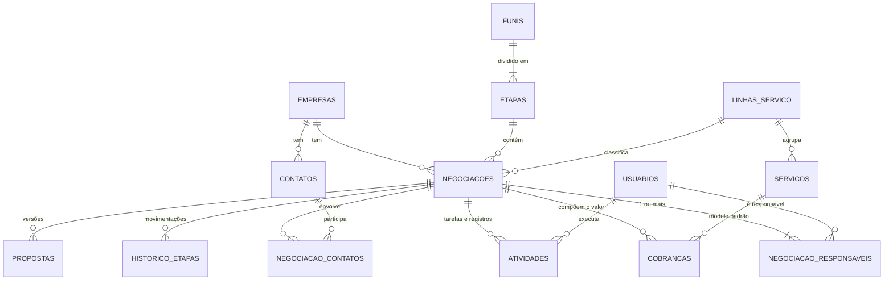

# CRM Kepha — Estrutura e pontos para validação

Proposta de estrutura para o CRM interno da Kepha, **antes de qualquer desenvolvimento**. Serve para validar com o time como cada funcionalidade vai funcionar e para fechar as decisões que mudam o desenho do backend.

**Base**: prints do RD Station CRM usado hoje — quadro de negociações e página da negociação "Captação de Recursos — Mobiis" (05/10/2026) · respostas às perguntas da primeira rodada (seção 10) · contexto dos projetos da Kepha registrado neste repositório (`docs/handoff.md`).

**Estado**: as decisões tomadas estão na seção 10. O resto é proposta. As perguntas da seção 9 marcadas como **bloqueantes** precisam de resposta antes do primeiro código.

> **Onde este documento vai morar.** O CRM é um produto diferente do gerador de escalas e terá repositório próprio. Este arquivo fica aqui só até esse repositório existir.

---

## 1. O que os prints mostram sobre o uso atual

Antes de desenhar o novo, vale ler o que o atual revela. Cada linha vira requisito.

### 1.1 Quadro de negociações

| # | Observação | O que significa | Consequência no CRM novo |
| --- | --- | --- | --- |
| O1 | 22 negociações abertas. Só a etapa "Negociando" tem valor (R$ 112.759,99), e mesmo nela há cards sem valor (Mobiis, Grupo Plátano). As outras etapas somam R$ 0,00. | O valor só aparece no fim do funil. Previsão de receita não existe hoje. | Valor obrigatório a partir de uma etapa (portão, R3) e previsão ponderada pela probabilidade da etapa. |
| O2 | Dos 21 cards visíveis, **15 não têm nenhuma tarefa aberta** e **6 exibem tarefa vencida**: 03/06, 08/06, 27/08, 23/09 e duas de 25/09. A mais antiga está parada há quatro meses. | O próximo passo não é registrado, ou é registrado e não é baixado. O card mostra só a tarefa mais atrasada: a Mobiis tem um follow-up em dia para 15/10, que o quadro esconde (O16). | Regra do próximo passo (R1) e de negociação parada (R2). O card mostra o atraso **e** a próxima tarefa. **É o ponto mais importante do sistema.** |
| O3 | A mesma empresa aparece duas vezes com nomes diferentes: "ELITE LOCACOES DE PLATAFORMAS E EQUIPAMENT…" (Alinhamento) e "Elite Locações Ltda" (Negociando), ambas com "Captação Recursos Fomento - Giro Fácil". | Empresa duplicada no cadastro, e possivelmente negociação duplicada também. | CNPJ como chave única, consulta automática aos dados públicos e aviso de nome parecido (R5). |
| O4 | Pluma Agroavícola tem 3 negociações abertas: inovação/BRDE, ISO e captação. | Um cliente com várias frentes ao mesmo tempo. | Página da empresa com todas as negociações, contatos e histórico consolidados. |
| O5 | O tipo de serviço está escrito no título: "Captação de Recursos", "IA", "Implementação de ISO", "LGPD", "Desenvolvimento Software", "Consultoria Sebrae". A grafia varia ("Captação", "Capitação", "captacao"). | Não dá para filtrar nem medir por linha de serviço. | Campo estruturado **Linha de serviço**, com título sugerido automaticamente (R6). |
| O6 | Há valor único (R$ 29.900,00) e valor recorrente (R$ 71.880,00). Há também R$ 999,99, que parece valor de preenchimento. | Mais de um modelo de cobrança. | Cobrança flexível (3.3). |
| O7 | Qualificação em estrelas = 1 em todos os cards. | Campo não usado. | Remover (P12). |
| O8 | Etiqueta "Nova" × "Em andamento" nos cards. | Significado não está claro. | Definir ou remover (P12). |
| O9 | "IA em órgão público — Prefeitura de Cambé". | Cliente do setor público, com rito de contratação próprio. | Empresa marcada como setor público. O funil é o mesmo (D5). |
| O10 | O RD tem "Priorizar negociações", "IA para Negociações" e rastreio de leitura de e-mail. | Recursos que o time pode estar usando, ou não. | Saber o que é usado antes de replicar (P11). |

### 1.2 Página da negociação (Mobiis)

| # | Observação | O que significa | Consequência no CRM novo |
| --- | --- | --- | --- |
| O11 | **Responsável: "CRM Kepha".** Todo o histórico ("CRM Kepha criou a tarefa", "CRM Kepha fez uma anotação") sai desse usuário. | O time compartilha uma única conta no RD. Hoje não se sabe quem fez o quê, nem quem cuida de cada negociação. | Login individual com a conta Microsoft (D7), autoria automática em tudo e responsáveis por negociação (D3). O histórico migrado fica sem autoria individual, porque essa informação não existe no RD. |
| O12 | O funil se chama **"Kepha 2026"**. | Provavelmente um funil por ano. | Um funil permanente; o recorte por ano vira filtro de data (P20). |
| O13 | Etapas completas: Lista Sem Contato → Em Conversa → Apresentado a Kepha → Alinhamento de Projeto → Negociando → Contrato. O cabeçalho mostra "Negociando (10 dias)". | Tempo na etapa já é uma informação que o time vê. | Etapas da R3; tempo na etapa no card e na negociação (R2). |
| O14 | Em "Negociando", previsão de fechamento e valor total estão **vazios**. Qualificação = 1. Campanha vazia. | Os campos que alimentariam a previsão não são preenchidos. | Portões de etapa (R3). Campanha e qualificação saem (P12). |
| O15 | A anotação fixada diz: *"Incluso na proposta a tabela exemplificativa do cálculo da taxa de sucesso. A pedido do Cliente."* | O êxito é calculado por uma tabela, e o cliente pede para vê-la. | Êxito com tabela de faixas (3.3) — preciso ver a tabela real (P3a). Anotação fixada no topo do histórico. |
| O16 | "O e-mail foi lido: Kepha - Proposta Comercial…" é uma **tarefa criada automaticamente** pelo rastreio de leitura, hoje atrasada. Ao lado dela há um follow-up em dia para 15/10. | Tarefas automáticas que ninguém baixa viram ruído de atraso. | O card mostra atraso e próxima tarefa separadamente (R1). Rastreio de leitura fica fora da fase 1 (P11). |
| O17 | Duas origens diferentes: **Fonte** da negociação = "Cliente Ativo"; **Origem** da empresa = "Networking Kepha". Também existe o campo "Segmentos Kepha: Retailtech - Varejo". | Uma origem diz como a relação começou; a outra, de onde veio esta oportunidade. A Kepha também tem uma segmentação própria de clientes. | Os dois campos ficam, cada um no seu lugar, com "Segmento Kepha" como lista configurável. |
| O18 | Empresa Mobiis: CNPJ vazio; o site é um link de busca do Bing; telefone com DDD 46 (Paraná) e estado SP. O celular do contato tem um dígito a menos que o da empresa (99269113 × 999269113). | Cadastro digitado à mão, sem conferência. | Consulta de CNPJ preenche endereço e UF (R5); validação de telefone e de site. Limpeza na migração (seção 8). |
| O19 | Abas: Histórico, E-mail, Tarefas, Questionários, Produtos, Arquivos, Propostas. | | Questionários sai se não for usado (P12). As demais têm equivalente. |

---

## 2. Princípios de desenho

1. **Dimensionado para a Kepha.** São 4 a 5 pessoas e dezenas de negociações abertas. Um projeto só, com um banco Postgres, resolve tudo. Cada peça a mais é algo a manter.
2. **O sistema cobra atualização.** CRM desatualizado é pior do que nenhum, porque dá falsa segurança (O2). As regras de próximo passo e de negociação parada são centrais, não acessórias.
3. **Histórico desde o primeiro dia.** Conversão por etapa, tempo em cada etapa e ciclo de venda dependem de registrar cada movimentação no momento em que acontece. Isso não se reconstrói depois.
4. **A empresa é a âncora; a negociação é a oportunidade.** Uma empresa (CNPJ) tem vários contatos e várias negociações ao longo do tempo (O4).
5. **Nada se apaga de verdade.** Exclusão lógica e trilha de auditoria. Perder uma negociação é um status, não uma exclusão.
6. **Portável desde o início.** A hospedagem começa na Vercel (D9), mas as regras de negócio não dependem dela e o banco é Postgres padrão. Mudar de casa depois troca só a camada de entrada.

---

## 3. Modelo de dados

### 3.1 Visão geral



### 3.2 Entidades centrais

#### empresas

| Campo | Observação |
| --- | --- |
| `cnpj` | Único quando preenchido, com validação dos dígitos. Opcional para quem ainda não tem CNPJ conhecido, pessoa física ou empresa estrangeira. |
| `razao_social`, `nome_fantasia` | Preenchidos pela consulta de CNPJ. O fantasia é editável. |
| `cnae_principal`, `porte`, `endereco`, `cidade`, `uf` | Vêm da consulta de CNPJ; substituem o campo "Segmento" do RD, que está vazio. |
| `site`, `telefone`, `linkedin` | Validados no cadastro (O18). |
| `segmento_kepha_id` | A segmentação própria da Kepha ("Retailtech - Varejo"), em lista configurável migrada do RD (O17). |
| `origem_id` | Como a relação com a empresa começou ("Networking Kepha"). |
| `setor_publico` | Derivado da natureza jurídica do CNPJ (grupo 1 = administração pública). |
| `papeis` | Marcações manuais: parceiro, órgão de fomento, fornecedor. |
| `pasta_drive_id` | Pasta da empresa no OneDrive (5.5). |

- A situação comercial (prospect, cliente, ex-cliente) **é calculada** a partir das negociações, não digitada. Assim não fica desatualizada.
- Empresa não tem responsável próprio. Com todos vendo tudo (D2), quem cuida dela são os responsáveis pelas negociações.

#### contatos

| Campo | Observação |
| --- | --- |
| `nome`, `cargo` | |
| `email` | Aviso de duplicidade quando já existe. |
| `telefone`, `whatsapp` | Formato internacional, validado (celular com 9 dígitos), com link que abre a conversa. |
| `empresa_id` | Empresa atual. |
| `base_legal` | LGPD; legítimo interesse por padrão (5.4). |

A ligação com a negociação fica em `negociacao_contatos`, com o papel do contato naquela venda (decisor, influenciador, técnico, financeiro) e qual é o principal.

#### funis e etapas

`etapas` guarda, além de nome e ordem:

- `probabilidade` — % usada na previsão ponderada;
- `dias_limite` — prazo para a negociação ser sinalizada como parada (R2);
- `campos_obrigatorios` — o portão de entrada da etapa (R3).

Tudo configurável pelo admin, sem mexer em código. Começa com um funil só (D5).

#### negociacoes

| Campo | Observação |
| --- | --- |
| `titulo` | Sugerido como "Linha de serviço — Empresa", editável (R6). |
| `empresa_id`, `funil_id`, `etapa_id` | Obrigatórios. |
| `linha_servico_id` | Obrigatório. Resolve O5. |
| `status` | aberta · ganha · perdida. |
| `fonte_id`, `parceiro_indicador_id` | De onde veio esta oportunidade ("Cliente Ativo") e, se for o caso, o parceiro que indicou (ex.: Grupo CRK). |
| `previsao_fechamento`, `probabilidade` | A probabilidade herda da etapa e pode ser ajustada. |
| `valor_estimado` | Número único para as etapas iniciais, antes de existir cobrança detalhada. |
| indicadores de valor | Calculados das cobranças (3.3): único, MRR, valor do contrato, êxito potencial. |
| `motivo_perda_id`, `detalhe_perda`, `concorrente` | Obrigatório ao perder. |
| `ganha_em`, `perdida_em` | |
| `etapa_desde`, `ultima_atividade_em`, `proxima_atividade_id`, `atividades_atrasadas` | Ver a nota abaixo. |
| `pasta_drive_id` | Pasta da negociação no OneDrive (5.5). |
| `versao` | Controle de concorrência: duas pessoas editando o mesmo card. |

Os campos de etapa, de atividade e os indicadores de valor são **copiados de propósito** para a própria negociação. O quadro mostra esses dados em todos os cards, e guardá-los ali evita uma consulta por card. A camada de serviço os atualiza na mesma transação da mudança que os afeta.

#### negociacao_responsaveis

Liga a negociação a **um ou mais** usuários (D3). Não existe responsável principal: todos têm o mesmo peso.

| Situação | Como fica |
| --- | --- |
| Filtro | "Responsável: Fulano" traz as negociações em que Fulano está entre os responsáveis. "Minhas" é o atalho para o usuário logado. |
| Alertas da negociação ("sem próximo passo", "parada") | Vão para todos os responsáveis. |
| Relatórios por pessoa | A negociação conta inteira para cada responsável, sem dividir valor. Divisão só faz sentido com metas, que ficam para a fase 2 (D10). |
| Usuário desativado | As negociações em que ele era o único responsável ficam sinalizadas para reatribuição. |

A **tarefa** continua com um único responsável: quem vai executá-la.

#### atividades — tarefas e registros numa tabela só

| Campo | Observação |
| --- | --- |
| `tipo` | tarefa · ligação · reunião · e-mail · WhatsApp · visita · anotação |
| `titulo`, `descricao` | |
| `agendada_para` | Data e hora. Vazio em anotação. |
| `concluida_em`, `resultado` | O que aconteceu. |
| `responsavel_id` | Quem executa. |
| `criado_por` | Preenchido pelo login; no histórico migrado, o usuário "Legado RD Station" (O11). |
| `fixada` | Anotação fixada no topo do histórico (O15). |
| `negociacao_id`, `empresa_id`, `contato_id` | Pelo menos um preenchido. |
| `origem`, `id_externo` | manual · e-mail · agenda. O id externo evita duplicar na sincronização da fase 2. |

- **Por que uma tabela só.** A linha do tempo da negociação e a lista "minhas tarefas de hoje" saem de uma consulta cada. Uma tarefa concluída vira registro sem mudar de tabela.
- **Por que chaves explícitas, e não o par genérico "tipo de entidade + id".** O banco garante a integridade: não existe atividade apontando para negociação inexistente.

#### historico_etapas

Colunas: `negociacao_id`, etapa de origem → etapa de destino, status de origem → status de destino, `movido_por` e `movido_em`.

É gravado na mesma transação de **toda** mudança de etapa ou de status, inclusive ganhar, perder e reabrir. É a fonte de todos os relatórios de conversão e tempo (R11).

#### auditoria

Colunas: `entidade`, `entidade_id`, `acao`, `alteracoes` (JSON com o antes e o depois de cada campo), `usuario_id` e `em`.

Responde perguntas como "quem mudou o valor desta negociação e quando".

### 3.3 Cobrança flexível

A Kepha cobra de vários jeitos e combina esses jeitos (D4). A estrutura precisa aceitar qualquer combinação sem mudar código.

**Como funciona.** O valor de uma negociação não é um número: é uma **lista de cobranças**. Cada cobrança tem um tipo, e cada tipo tem os seus campos.

| Tipo | Campos | Exemplo |
| --- | --- | --- |
| Único | Valor, número de parcelas, previsão do primeiro pagamento | Consultoria: R$ 29.900 em 3 parcelas |
| Recorrente | Valor por período, periodicidade (mensal, trimestral, anual), prazo em períodos ou "sem prazo", início previsto | SaaS: R$ 5.990/mês por 12 meses |
| Êxito | Base estimada (valor a captar); percentual fixo **ou** tabela de faixas; mínimo e teto opcionais; gatilho do pagamento (aprovação, contratação ou liberação do recurso) | Captação: 3% sobre R$ 2 milhões, pago na liberação |
| Variável | Quantidade estimada × valor unitário, com a unidade (hora, diária, usuário) | 40 horas de consultoria a R$ 250 |

Qualquer cobrança aceita desconto, em % ou em valor.

**Combinações.** Uma negociação tem quantas cobranças precisar:

- Captação: entrada de R$ 5.000 (único) + 3% de êxito.
- SaaS: implantação de R$ 8.000 (único) + R$ 1.500/mês por 24 meses (recorrente).
- Projeto: R$ 60.000 em 4 parcelas (único) + horas extras sob demanda (variável).

**Modelos no catálogo.** Cada serviço do catálogo tem um modelo de cobrança padrão. Escolher "Captação de Recursos" numa negociação já cria "Entrada (único)" + "Êxito (% sobre o valor captado)", e o time só ajusta os números. Uma combinação nova não pede código: vira um modelo novo no catálogo, ou cobranças adicionadas à mão.

**Tabela de faixas do êxito.** Há duas formas comuns de aplicar faixas. Com faixas de 5% até R$ 1 milhão e 3% acima, sobre uma captação de R$ 2 milhões:

| Forma | Cálculo | Êxito |
| --- | --- | --- |
| Progressiva (como o IR): cada faixa incide sobre a sua fatia | 5% × 1 mi + 3% × 1 mi | R$ 80.000 |
| Por faixa: o valor inteiro paga o percentual da faixa em que cai | 3% × 2 mi | R$ 60.000 |

O sistema aceita as duas, escolhida por tabela. A forma que a Kepha usa vira o padrão (P3a).

**O que o sistema calcula.** Cada cobrança gera indicadores, somados na negociação:

| Indicador | Cálculo | Onde aparece |
| --- | --- | --- |
| Único | Soma das cobranças únicas | Card, relatórios |
| MRR | Recorrentes convertidas para mês (anual ÷ 12, trimestral ÷ 3) | Card ("R$ 1.500/mês"), relatório de receita recorrente |
| Valor do contrato | Único + recorrente × prazo + variável. Recorrente sem prazo conta 12 meses (P3b) | Total do quadro, previsão ponderada |
| Êxito potencial | Êxito calculado sobre a base estimada | **À parte**, com destaque próprio |

No card: **"R$ 8 mil + R$ 1,5 mil/mês · êxito ~R$ 60 mil"**.

O êxito fica fora do total do quadro porque depende de um evento que a venda não controla: a aprovação do recurso. Se entrasse no total, uma captação de R$ 10 milhões a 3% dominaria a previsão com dinheiro que pode não vir.

**Armazenamento.** Uma tabela `cobrancas` guarda:

- os campos comuns em colunas: tipo, serviço, descrição, desconto;
- os indicadores calculados em colunas, para os relatórios somarem direto;
- os campos específicos de cada tipo num JSON validado por tipo (faixas, gatilho, periodicidade).

Um parâmetro novo, como reajuste anual, entra no JSON sem migração de banco.

**Propostas congelam as cobranças.** Cada versão de proposta guarda uma cópia das cobranças no momento do envio. Assim a V1.0 e a V1.1 mostram o que mudou, mesmo que a negociação continue sendo editada.

### 3.4 Demais tabelas

| Tabela | Conteúdo |
| --- | --- |
| `propostas` | Negociação, versão (1.0, 1.1…), status (rascunho · enviada · aceita · recusada · expirada), cópia das cobranças, validade, data de envio, arquivo no OneDrive. |
| `linhas_servico`, `servicos` | Catálogo, com o modelo de cobrança padrão de cada serviço. Lista inicial a partir do RD: Captação de Recursos, IA, Desenvolvimento de Software, SaaS, ISO, LGPD, Gestão da Inovação, Consultoria. |
| `fontes`, `origens` | Fonte da negociação ("Cliente Ativo") e origem da empresa ("Networking Kepha"). Migradas do RD. |
| `segmentos_kepha` | "Retailtech - Varejo" e as demais. Migrados do RD. |
| `motivos_perda` | Migrados do RD e revistos. |
| `tags` + junções | Rótulos livres em empresa e negociação. |
| `usuarios` | Nome, e-mail Microsoft, papel, ativo. |
| `notificacoes` | Usuário, tipo, conteúdo, lida em. |
| `metas` | Fase 2 (D10). |

Arquivos não têm tabela própria: a pasta no OneDrive é a fonte da verdade (5.5).

### 3.5 Convenções

- Chave `uuid`. Datas em `timestamptz`, armazenadas em UTC e exibidas em America/Sao_Paulo.
- Dinheiro em `numeric(14,2)`, nunca em ponto flutuante.
- Exclusão lógica (`excluido_em`) em empresas, contatos, negociações e atividades.
- Busca sem acento e tolerante a erro de digitação (extensões `unaccent` e `pg_trgm` do Postgres): "captacao" encontra "Captação", e "Capitação" aparece como parecido.

---

## 4. Como as funcionalidades vão funcionar

Cada regra é proposta e precisa de validação.

### R1 — Próximo passo

- Toda negociação aberta deveria ter uma tarefa futura.
- Ao concluir uma tarefa, o sistema abre na hora o formulário da próxima, já ligado à negociação. Dá para pular, mas o card passa a exibir **"Sem próximo passo"** em destaque.
- O card mostra duas informações separadas: **quantas tarefas estão atrasadas** e **qual é a próxima tarefa futura**. Hoje o RD mostra só a mais atrasada e esconde o resto (O2, O16).
- **Sinalizar, não bloquear** (P9). Obrigar a criar tarefa para conseguir salvar gera tarefa falsa só para passar.

### R2 — Negociação parada

- Cada etapa tem um prazo (ex.: Em Conversa 15 dias, Negociando 10 dias).
- Passou do prazo na mesma etapa, o card ganha o sinal **"Parada há N dias"** e entra no resumo diário dos responsáveis.
- É diferente da R1: uma negociação pode ter tarefas em dia e mesmo assim não sair do lugar há dois meses.
- Prazos iniciais a definir com o time (P10).

### R3 — Portões de etapa

Mover para certas etapas exige campos preenchidos. Se faltar algo, o card não muda de etapa e o sistema abre um formulário só com o que falta. Proposta inicial, com as etapas reais (O13):

| Para entrar em | Exige |
| --- | --- |
| Em Conversa | Contato principal |
| Apresentado a Kepha | Linha de serviço |
| Alinhamento de Projeto | Valor estimado e previsão de fechamento |
| Negociando | Cobranças detalhadas e proposta registrada (R7) |
| Contrato | Proposta aceita |
| Ganha | Data de assinatura |
| Perdida | Motivo de perda |

Com isso, a Mobiis não estaria em "Negociando" com valor e previsão vazios (O14).

### R4 — Ganhar, perder, reabrir

- Ganha e perdida são **status, não etapas**. O quadro mostra só as abertas, como o filtro "Em andamento" de hoje; ganhas e perdidas aparecem pelo filtro e na lista.
- Perder exige um motivo da lista, com detalhe opcional.
- Reabrir volta para a última etapa e fica registrado no histórico.

### R5 — Cadastro de empresa por CNPJ

- Digita o CNPJ e o sistema consulta os dados públicos da Receita (ex.: BrasilAPI) para preencher razão social, fantasia, CNAE, endereço, UF e natureza jurídica.
- Se o CNPJ já existe, abre a empresa existente em vez de criar outra.
- Sem CNPJ, aceita só o nome, mas antes de salvar mostra as empresas de nome parecido. Teria pegado "Elite Locações Ltda" × "ELITE LOCACOES DE PLATAFORMAS…" (O3).
- **Fusão de duplicadas**: o admin escolhe a empresa principal e o sistema move contatos, negociações e histórico para ela.

### R6 — Título automático

O sistema sugere "Linha de serviço — Empresa" (ex.: "Captação de Recursos — Mobiis"), e o título continua editável. A linha de serviço vira filtro e dimensão de relatório.

### R7 — Propostas versionadas

- Cada negociação guarda suas versões de proposta (V1.0, V1.1…), com status, cobranças congeladas (3.3), validade e arquivo.
- Marcar uma proposta como enviada registra a atividade na linha do tempo.
- Na fase 1 o arquivo é enviado para a pasta da negociação. Gerar a partir do modelo .docx da Kepha fica para a fase 2.

### R8 — Quadro

- As colunas são as etapas do funil. O cabeçalho de cada uma mostra a quantidade de negociações, o valor do contrato total e ponderado (valor × probabilidade) e, à parte, o êxito potencial.
- O card mostra a empresa, os responsáveis (iniciais), o resumo de valor, o atraso e a próxima tarefa (R1), e o sinal de parada (R2).
- Arrastar entre colunas muda a etapa, passando pelos portões da R3.
- Dentro da coluna, a ordem segue um critério escolhido (próxima tarefa, valor, criação). Não há ordenação manual.
- Filtros: **responsável** (um ou vários, com atalho "Minhas"), status, linha de serviço, fonte, segmento Kepha, tags, período de criação ou de fechamento, "sem próximo passo", "atrasadas" e "paradas".
- A mesma consulta alimenta a visão de lista: tabela com colunas escolhidas e exportação CSV.

### R9 — Minhas tarefas

Três blocos: atrasadas, hoje e próximos 7 dias. Concluir é um clique e dispara a R1.

### R10 — Resumo diário

Um e-mail por pessoa às 8h, enviado pela caixa do CRM no Microsoft 365, com:

- tarefas do dia;
- tarefas atrasadas;
- negociações sem próximo passo;
- negociações paradas.

### R11 — Relatórios da fase 1

- Funil: quantidade e valor por etapa, total e ponderado, com o êxito potencial à parte.
- Conversão entre etapas e taxa de ganho, por período, linha de serviço, fonte e responsável.
- Tempo médio em cada etapa e ciclo total de venda.
- Motivos de perda.
- Previsão de fechamento por mês, ponderada.
- Receita recorrente (MRR) contratada e em negociação.
- Atividades por pessoa.

Todos saem de `historico_etapas`, `negociacoes` e `cobrancas`. É por isso que o histórico precisa existir desde o primeiro dia.

---

## 5. Estrutura do backend

### 5.1 Stack

Ajustada à decisão de hospedar no GitHub + Vercel (D9) e usar Microsoft 365 (D7) e OneDrive (D8).

| Camada | Escolha | Por quê |
| --- | --- | --- |
| Aplicação | Next.js (App Router) em TypeScript: front e API num projeto só | É o formato nativo da Vercel: um repositório, um deploy. |
| Regras de negócio | `src/modulos/*` em TypeScript puro, sem depender do Next | Se a hospedagem mudar, só a camada HTTP muda (princípio 6). |
| Banco | PostgreSQL na Neon, integração oficial da Vercel, com conexão em pool | A Vercel não tem Postgres próprio. A Neon é a integração nativa e serverless. É Postgres padrão: muda de casa com `pg_dump`. |
| Migrations | Drizzle | Leve e sem dependência nativa, bom para funções serverless. A estrutura do banco fica versionada no repositório. |
| Login | Auth.js com Microsoft Entra ID | Login com a conta Microsoft da Kepha, restrito ao tenant da empresa **e** aos usuários cadastrados no CRM. |
| Arquivos | OneDrive/SharePoint via Microsoft Graph | D8. Detalhes em 5.5. |
| E-mail do sistema | Microsoft Graph, a partir de uma caixa compartilhada do CRM (ex.: `crm@…`) | Resumo diário sem contratar serviço de e-mail. Caixa compartilhada não consome licença. |
| Tarefas agendadas | Vercel Cron chamando rotas protegidas por segredo | Na Vercel não há processo rodando o tempo todo. Substitui a fila que eu tinha proposto antes. |
| Front | React (no Next), TanStack Query, dnd-kit para arrastar cards | |
| Ambientes | `main` → produção. Cada pull request ganha uma pré-visualização com **banco separado** (branch da Neon), nunca o de produção | Testar sem tocar em dado real. |
| Backup | O da Neon + cópia diária própria: GitHub Actions roda `pg_dump` e guarda no OneDrive | A restauração do plano gratuito da Neon cobre pouco tempo. A cópia própria não depende do fornecedor. |

### 5.2 Pontos de atenção da Vercel

1. **Plano.** O plano gratuito (Hobby) é restrito a uso pessoal e não comercial. Um CRM da empresa precisa do **Pro** (P18). O Pro é cobrado por membro que mexe no projeto na Vercel, não por usuário do CRM.
2. **Agendamento.** No Hobby, cada tarefa agendada roda no máximo uma vez por dia e sem horário exato. O Pro resolve isso.
3. **Tempo de execução.** Funções têm tempo máximo de execução. A migração do RD não roda na Vercel: é um script executado à parte, uma vez (seção 8).
4. **Região.** Funções e banco na mesma região, para cada consulta não atravessar continentes.

### 5.3 Módulos

```
src/
  app/                  telas e rotas HTTP (Next) — camada fina
    api/cron/           rotas chamadas pelo Vercel Cron
  modulos/
    auth/               login Microsoft, usuários e papéis
    empresas/           cadastro, consulta de CNPJ, deduplicação, fusão
    contatos/
    funis/              funis, etapas, portões, prazos
    negociacoes/        cadastro, responsáveis, mover, ganhar/perder/reabrir
    cobrancas/          tipos de cobrança, faixas de êxito, indicadores
    atividades/         tarefas, registros, agenda
    propostas/          versões e cópia das cobranças
    relatorios/
    busca/
    notificacoes/       resumo diário e alertas
    microsoft/          Graph: arquivos no OneDrive, envio de e-mail, (fase 2) caixa e agenda
  compartilhado/
    auditoria/          registra toda alteração
    db/                 conexão, transações, migrations
scripts/
  migracao-rd/          extração, transformação e carga do RD Station
```

Um módulo não acessa tabela de outro diretamente; chama o serviço dele. Mover uma negociação, por exemplo, passa por `negociacoes`, que pede a `funis` a conferência do portão. Depois grava a negociação, o `historico_etapas` e a auditoria na mesma transação.

### 5.4 API — rotas principais

| Rota | Faz |
| --- | --- |
| `GET /api/funis/:id/quadro` | Colunas com contagem, totais e os cards de cada etapa, já filtrados |
| `GET /api/negociacoes` | Lista paginada com filtros e ordenação (visão de lista e exportação) |
| `POST /api/negociacoes` | Cria, com pelo menos um responsável |
| `PATCH /api/negociacoes/:id` | Edita. Exige `versao`: se outra pessoa alterou antes, devolve 409 e o front recarrega |
| `PUT /api/negociacoes/:id/responsaveis` | Define os responsáveis (mínimo 1) |
| `PUT /api/negociacoes/:id/cobrancas` | Substitui as cobranças e recalcula os indicadores |
| `POST /api/negociacoes/:id/mover` | Muda de etapa. Se faltar campo do portão, devolve 422 com a lista do que falta |
| `POST /api/negociacoes/:id/ganhar` · `/perder` · `/reabrir` | Mudanças de status, com as exigências da R4 |
| `GET /api/negociacoes/:id/linha-do-tempo` | Atividades, mudanças de etapa, propostas e alterações, em ordem, com as anotações fixadas primeiro |
| `GET /api/negociacoes/:id/arquivos` · `POST` | Lista e envia arquivos da pasta no OneDrive |
| `GET /api/empresas/cnpj/:cnpj` | Devolve a empresa existente ou os dados públicos para o cadastro |
| `GET /api/empresas/parecidas?nome=` | Candidatas a duplicidade |
| `POST /api/empresas/:id/fundir` | Fusão de duplicadas (admin) |
| `GET /api/atividades?situacao=atrasadas\|hoje\|proximas` | Minhas tarefas |
| `POST /api/atividades/:id/concluir` | Conclui e devolve a sugestão da próxima (R1) |
| `GET /api/relatorios/...` | Funil, conversão, tempo por etapa, perdas, previsão, MRR, atividades |
| `GET /api/busca?q=` | Busca global em empresas, contatos e negociações |
| `POST /api/cron/resumo-diario` | Chamada pelo Vercel Cron às 8h (11h UTC) |

### 5.5 Arquivos no OneDrive

- **Biblioteca compartilhada, não o OneDrive pessoal de alguém** (P17). Pode ser um site do SharePoint do time, que aparece no OneDrive de todos. No OneDrive pessoal, se a pessoa sair da Kepha, os arquivos vão junto.
- **Pastas criadas pelo CRM**: `CRM/<Empresa>/<Negociação>/`. O banco guarda o **id** da pasta, não o caminho, então renomear a empresa ou a negociação não quebra nada.
- **A pasta é a fonte da verdade.** A aba Arquivos lista o conteúdo real da pasta via Graph. O que alguém arrastar para a pasta pelo OneDrive, ou salvar direto do Word, aparece no CRM.
- **Envio em nome de quem está logado.** O arquivo aparece no OneDrive como enviado pela pessoa, não por um robô.
- **Abrir um arquivo** leva ao Office online.

### 5.6 O que precisa ser feito no Microsoft 365

Exige alguém com acesso de administrador (P16):

1. **Registro do aplicativo no Entra ID.** Login dos usuários e permissões do Graph:
   - acesso à biblioteca do CRM, em nome de quem está logado;
   - envio de e-mail pela caixa do CRM, restrito a ela.
2. **Caixa compartilhada** do CRM, para o resumo diário.
3. **Biblioteca** (site do SharePoint) para os arquivos.
4. **Consentimento do administrador** para as permissões acima.

### 5.7 Pontos transversais

- **Permissões.** Todos veem tudo (D2), com dois papéis:
  - **Admin**: configura funis, etapas, catálogo, listas e usuários; faz fusões e exclusões.
  - **Comercial**: opera o dia a dia.
- **Acesso.** Só entra quem tem conta Microsoft da Kepha **e** foi cadastrado no CRM. Ser desligado no Microsoft 365 corta o acesso ao CRM.
- **Auditoria.** Toda escrita passa por um ponto único que grava o antes e o depois, com o autor vindo do login.
- **Concorrência.** O campo `versao` impede que uma edição sobrescreva outra sem aviso.
- **Exclusão.** Lógica e restaurável pelo admin. Exclusão definitiva só por pedido de titular (LGPD).
- **LGPD.** Contatos são dados pessoais. O sistema precisa:
  - registrar a base legal (legítimo interesse por padrão);
  - exportar e anonimizar um contato a pedido;
  - registrar quem acessou.

  A Kepha vende consultoria de LGPD: o próprio CRM precisa passar na régua que ela aplica nos clientes.
- **Observabilidade.** Logs da Vercel e captura de erros.

### 5.8 Integrações

| Integração | Fase 1 | Fase 2 |
| --- | --- | --- |
| Consulta de CNPJ | Sim | — |
| OneDrive | Pastas por empresa e negociação, envio e listagem | — |
| E-mail | Resumo diário pela caixa do CRM. Registro manual de e-mail na linha do tempo | Caixa de cada pessoa sincronizada via Graph: e-mails trocados com contatos aparecem na negociação |
| Agenda | — | Reunião criada no CRM vai para a agenda do Outlook/Teams, e vice-versa |
| WhatsApp | Botão que abre a conversa + registro manual do tipo "WhatsApp" | API oficial, que tem custo por uso. Só se o volume justificar |
| IA | — | Resumo da negociação, sugestão de próximo passo, rascunho de follow-up, priorização |
| Propostas | Arquivo na pasta da negociação | Geração a partir do modelo .docx da Kepha, já com as cobranças e a tabela de êxito |

---

## 6. Telas

1. **Quadro de negociações**, com alternância para lista.
2. **Negociação**: barra de etapas com dias na etapa, próximas tarefas, linha do tempo com anotações fixadas, responsáveis, contatos, cobranças, propostas, arquivos.
3. **Empresa**: dados, contatos, todas as negociações (abertas, ganhas, perdidas) e linha do tempo consolidada.
4. **Contato**.
5. **Minhas tarefas**.
6. **Relatórios**.
7. **Configurações** (admin): funil e etapas (portão, probabilidade, prazo), catálogo de serviços com modelos de cobrança, fontes, origens, segmentos, motivos de perda, usuários.

A importação de planilha saiu da fase 1: a migração do RD é feita por script (seção 8).

---

## 7. Faseamento proposto

| Fase | Conteúdo |
| --- | --- |
| **1 — substitui o RD Station** | Modelo da seção 3, incluindo cobrança flexível; regras R1 a R11; login Microsoft; consulta de CNPJ e fusão de duplicadas; arquivos no OneDrive; resumo diário por e-mail; migração do RD; exportação CSV. |
| **2** | Sincronização de e-mail e agenda, geração de proposta pelo modelo, IA, metas (D10), WhatsApp oficial, acompanhamento pós-venda (P7). |

**Critério para virar a chave:** o time opera uma semana só no CRM novo, sem voltar ao RD, com os dados migrados conferidos.

---

## 8. Migração do RD Station

1. **Extrair** pela API do RD Station CRM, com o token da conta: negociações abertas e fechadas, empresas, contatos, tarefas, anotações, produtos, fontes, motivos de perda e campos personalizados (como "Segmentos Kepha").
2. **Guardar a exportação bruta no OneDrive.** Fica como registro permanente depois que a assinatura do RD acabar.
3. **Transformar**:
   - Funis por ano ("Kepha 2026" e anteriores, se houver) → um funil só, com o ano preservado na data de criação (P20).
   - Linha de serviço extraída do título, com revisão manual do que não casar (O5).
   - Produtos do RD → cobranças. O êxito não existe no RD: é preenchido à mão nas captações abertas.
   - Autor "CRM Kepha" → usuário "Legado RD Station". O histórico vem inteiro, mas sem autoria individual, porque ela não existe no RD (O11).
   - **Responsáveis das negociações abertas**: o script gera uma planilha com as 22 abertas para o time preencher antes da carga.
   - Empresas deduplicadas por CNPJ (consultado quando estiver vazio) e por nome parecido. A Elite Locações é um caso conhecido (O3).
   - Telefones e sites inválidos sinalizados para correção (O18).
4. **Carregar num banco de teste** e conferir quantidades e totais por etapa contra o RD.
5. **Virar a chave** num dia combinado. O RD fica só para consulta até o fim da assinatura.

O alcance da migração está na P5.

---

## 9. Perguntas em aberto

### Bloqueantes

| # | Pergunta | Recomendação |
| --- | --- | --- |
| P3a | **Êxito**: a tabela de faixas é progressiva ou por faixa (3.3)? Tem mínimo ou teto? Quando o êxito é pago: na aprovação, na contratação ou na liberação do recurso — e, se a liberação vier em parcelas, o êxito acompanha? **Se puder, mande a tabela que foi na proposta da Mobiis.** | Aceitar as duas formas e definir como padrão a que a Kepha usa. |
| P3b | **SaaS**: os contratos recorrentes são mensais ou anuais? Têm prazo? Quando não têm, quantos meses contar no valor do funil? | 12 meses para recorrente sem prazo. |
| P16 | **Microsoft 365**: quem é o administrador? Ele precisa registrar o aplicativo, criar a caixa compartilhada e a biblioteca, e dar o consentimento (5.6). | — |
| P17 | **OneDrive**: os arquivos ficam numa biblioteca compartilhada ou no OneDrive pessoal de alguém? | Biblioteca compartilhada (5.5). |
| P18 | **Vercel**: ok assinar o plano Pro? O gratuito não permite uso comercial (5.2). | Pro. |

### Não bloqueantes — se não houver resposta, sigo a recomendação

| # | Pergunta | Recomendação |
| --- | --- | --- |
| P5 | O que migrar do RD: só as abertas, ou também ganhas e perdidas? Tarefas e anotações antigas? | Tudo o que a API entregar. Abertas e fechadas dos últimos 24 meses entram no CRM; o restante fica só na exportação bruta. |
| P7 | O CRM termina no "ganho" ou acompanha a execução? Em captação, o êxito só se realiza se o recurso for aprovado. | Fase 1 termina no ganho. Acompanhar o resultado do edital na fase 2. |
| P9 | Próximo passo: bloquear ou só sinalizar (R1)? | Sinalizar. |
| P10 | A tabela de portões da R3 faz sentido? Qual o prazo de cada etapa para a R2? | Começar com a R3 como está e prazos de 15 dias em cada etapa, ajustando com o uso. |
| P11 | "Priorizar negociações", "IA para Negociações" e rastreio de leitura de e-mail: alguém usa? | Fora da fase 1. O rastreio de leitura, em especial, é pouco confiável: vários clientes de e-mail abrem as imagens sozinhos e marcam como "lido" o que ninguém leu. |
| P12 | Qualificação (estrelas), Campanha, Questionários e a etiqueta "Nova"/"Em andamento": alguém usa? | Remover os quatro. "Nova" vira um sinal automático de "nenhuma interação ainda". |
| P13 | Registrar o parceiro que indicou (ex.: Grupo CRK)? Há comissão? | Campo de parceiro indicador. Comissão só se houver acordo formal. |
| P14 | O lembrete diário vai só por e-mail, ou também pelo Teams? | E-mail + aviso dentro do CRM. Teams na fase 2. |
| P20 | Existem funis de anos anteriores ("Kepha 2025")? | Juntar tudo num funil só e usar o filtro de período. |

---

## 10. Registro de decisões

| # | Data | Decisão |
| --- | --- | --- |
| D1 | 05/10/2026 | Uso só interno. Sem separação de dados por organização. |
| D2 | 05/10/2026 | 4 a 5 usuários. Todos veem tudo. |
| D3 | 05/10/2026 | Cada negociação tem um ou mais responsáveis, com filtro por responsável. |
| D4 | 05/10/2026 | Cobrança flexível: SaaS recorrente, serviços pontuais e êxito sobre o valor captado, combináveis entre si. |
| D5 | 05/10/2026 | Um funil para todas as linhas de serviço. |
| D6 | 05/10/2026 | O CRM atual é o RD Station CRM. |
| D7 | 05/10/2026 | E-mail corporativo é Microsoft 365. |
| D8 | 05/10/2026 | Arquivos no OneDrive. |
| D9 | 05/10/2026 | Hospedagem inicial no GitHub do usuário + Vercel. Migrar depois se fizer sentido. |
| D10 | 05/10/2026 | Metas de venda ficam para a fase 2. |
