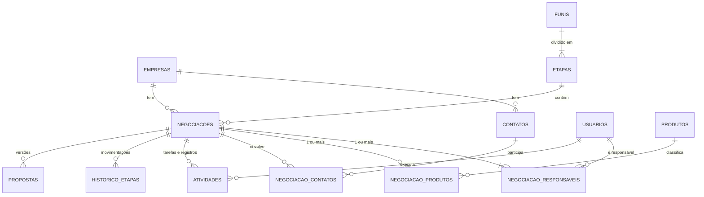

# CRM Kepha — Estrutura e pontos para validação

Proposta de estrutura para o CRM interno da Kepha, **antes de qualquer desenvolvimento**. Serve para validar com o time como cada funcionalidade vai funcionar e para fechar as decisões que mudam o desenho do backend.

**Base**: prints do RD Station CRM usado hoje — quadro de negociações e página da negociação "Captação de Recursos — Mobiis" (05/10/2026) · duas rodadas de respostas (seção 10) · contexto dos projetos da Kepha registrado neste repositório (`docs/handoff.md`).

**Estado**: as decisões estão na seção 10. **Nada mais bloqueia o modelo de dados.** O que falta (seção 9) é necessário para o primeiro deploy, não para começar o código.

> **Onde este documento vai morar.** O CRM é um produto diferente do gerador de escalas e terá repositório próprio. Este arquivo fica aqui só até esse repositório existir.

---

## 1. O que os prints mostram sobre o uso atual

Antes de desenhar o novo, vale ler o que o atual revela. Cada linha vira requisito.

### 1.1 Quadro de negociações

| # | Observação | O que significa | Consequência no CRM novo |
| --- | --- | --- | --- |
| O1 | 22 negociações abertas. Só a etapa "Negociando" tem valor (R$ 112.759,99), e mesmo nela há cards sem valor (Mobiis, Grupo Plátano). As outras etapas somam R$ 0,00. | O valor só aparece no fim do funil, quando aparece. | Valor continua opcional (D12), mas a coluna mostra quantas negociações estão sem valor, para o total não enganar (R8). |
| O2 | Dos 21 cards visíveis, **15 não têm nenhuma tarefa aberta** e **6 exibem tarefa vencida**: 03/06, 08/06, 27/08, 23/09 e duas de 25/09. A mais antiga está parada há quatro meses. | O próximo passo não é registrado, ou é registrado e não é baixado. O card mostra só a tarefa mais atrasada: a Mobiis tem um follow-up em dia para 15/10, que o quadro esconde (O16). | Regra do próximo passo (R1) e de negociação parada (R2). O card mostra o atraso **e** a próxima tarefa. **É o ponto mais importante do sistema.** |
| O3 | A mesma empresa aparece duas vezes com nomes diferentes: "ELITE LOCACOES DE PLATAFORMAS E EQUIPAMENT…" (Alinhamento) e "Elite Locações Ltda" (Negociando), ambas com "Captação Recursos Fomento - Giro Fácil". | Empresa duplicada no cadastro, e possivelmente negociação duplicada também. | CNPJ como chave única, consulta aos dados públicos e aviso de nome parecido (R5). |
| O4 | Pluma Agroavícola tem 3 negociações abertas: inovação/BRDE, ISO e captação. | Um cliente com várias frentes ao mesmo tempo. | Página da empresa com todas as negociações, contatos e histórico consolidados. |
| O5 | O tipo de serviço está escrito no título: "Captação de Recursos", "IA", "Implementação de ISO", "LGPD", "Desenvolvimento Software", "Consultoria Sebrae". A grafia varia ("Captação", "Capitação", "captacao"). | Não dá para filtrar nem medir por produto. | Campo estruturado **Produto**, com filtro (D17) e título sugerido (R6). |
| O6 | Há valor único (R$ 29.900,00) e valor recorrente (R$ 71.880,00). Há também R$ 999,99, que parece valor de preenchimento. | Dois tipos de valor, que precisam ser distinguidos. | Dois campos livres, um único e um recorrente, com rótulos inconfundíveis (3.3). |
| O7 | Qualificação em estrelas = 1 em todos os cards. | Campo não usado. | Remover (P12). |
| O8 | Etiqueta "Nova" × "Em andamento" nos cards. | Significado não está claro. | Definir ou remover (P12). |
| O9 | "IA em órgão público — Prefeitura de Cambé". | Cliente do setor público. | Empresa marcada como setor público, no mesmo funil. |
| O10 | O RD tem "Priorizar negociações", "IA para Negociações" e rastreio de leitura de e-mail. | Recursos que o time pode estar usando, ou não. | Saber o que é usado antes de replicar (P11). |

### 1.2 Página da negociação (Mobiis)

| # | Observação | O que significa | Consequência no CRM novo |
| --- | --- | --- | --- |
| O11 | **Responsável: "CRM Kepha".** O histórico da Mobiis sai desse usuário. O time tem usuários individuais no RD; "CRM Kepha" é um usuário genérico a mais (D11). | Parte das negociações e do histórico não tem dono identificável. | No CRM novo todo login é pessoal (conta Microsoft). Ações automáticas aparecem como "Sistema". Na migração, as negociações sob "CRM Kepha" são reatribuídas (seção 8). |
| O12 | O funil se chama **"Kepha 2026"**. | Provavelmente um funil por ano. | Um funil permanente, com filtro por mês e ano (D16, D17). |
| O13 | Etapas completas: Lista Sem Contato → Em Conversa → Apresentado a Kepha → Alinhamento de Projeto → Negociando → Contrato. O cabeçalho mostra "Negociando (10 dias)". | Tempo na etapa já é uma informação que o time vê. | Etapas da R3; tempo na etapa no card e na negociação (R2). |
| O14 | Em "Negociando", previsão de fechamento e valor total estão **vazios**. Qualificação = 1. Campanha vazia. | Os campos de previsão não são preenchidos. | Valor não vira obrigatório (D12). Campanha e qualificação saem (P12). |
| O15 | A anotação fixada diz: *"Incluso na proposta a tabela exemplificativa do cálculo da taxa de sucesso. A pedido do Cliente."* | A tabela de êxito varia de proposta para proposta. | O CRM não modela o êxito (D13): a tabela fica no arquivo da proposta. Anotação fixada no topo do histórico. |
| O16 | "O e-mail foi lido: Kepha - Proposta Comercial…" é uma **tarefa criada automaticamente** pelo rastreio de leitura, hoje atrasada. Ao lado dela há um follow-up em dia para 15/10. | Tarefas automáticas que ninguém baixa viram ruído de atraso. | O card mostra atraso e próxima tarefa separadamente (R1). Rastreio de leitura fica fora da fase 1 (P11). |
| O17 | Duas origens diferentes: **Fonte** da negociação = "Cliente Ativo"; **Origem** da empresa = "Networking Kepha". Também existe o campo "Segmentos Kepha: Retailtech - Varejo". | Uma origem diz como a relação começou; a outra, de onde veio esta oportunidade. A Kepha também tem uma segmentação própria de clientes. | Os dois campos ficam, cada um no seu lugar, com "Segmento Kepha" como lista configurável. |
| O18 | Empresa Mobiis: CNPJ vazio; o site é um link de busca do Bing; telefone com DDD 46 (Paraná) e estado SP. O celular do contato tem um dígito a menos que o da empresa (99269113 × 999269113). | Cadastro digitado à mão, sem conferência. | Consulta de CNPJ preenche endereço e UF (R5); validação de telefone e de site. Limpeza na migração (seção 8). |
| O19 | Abas: Histórico, E-mail, Tarefas, Questionários, Produtos, Arquivos, Propostas. | | Questionários sai se não for usado (P12). As demais têm equivalente. |

---

## 2. Princípios de desenho

1. **Dimensionado para a Kepha.** São 4 a 5 pessoas e dezenas de negociações abertas. Um projeto só, com um banco Postgres, resolve tudo. Cada peça a mais é algo a manter.
2. **O sistema cobra atualização, sem burocracia.** CRM desatualizado é pior do que nenhum, porque dá falsa segurança (O2). O próximo passo e a negociação parada são sinalizados com destaque; o resto é opcional (D12).
3. **Histórico desde o primeiro dia.** Conversão por etapa, tempo em cada etapa e ciclo de venda dependem de registrar cada movimentação no momento em que acontece. Isso não se reconstrói depois.
4. **A empresa é a âncora; a negociação é a oportunidade.** Uma empresa (CNPJ) tem vários contatos e várias negociações ao longo do tempo (O4).
5. **Nada se apaga de verdade.** Exclusão lógica e trilha de auditoria. Perder uma negociação é um status, não uma exclusão.
6. **Portável e sem custo de hospedagem.** O código roda igual na Vercel, no Cloudflare ou num servidor próprio, e o banco é Postgres padrão. Trocar de hospedagem é trocar a configuração de deploy, não o código (5.2).

---

## 3. Modelo de dados

### 3.1 Visão geral



### 3.2 Entidades centrais

#### empresas

| Campo | Observação |
| --- | --- |
| `cnpj` | Único quando preenchido, com validação dos dígitos. Opcional para quem ainda não tem CNPJ conhecido, pessoa física ou empresa estrangeira. |
| `razao_social`, `nome_fantasia` | Preenchidos pela consulta de CNPJ. O fantasia é editável. |
| `cnae_principal`, `porte`, `endereco`, `cidade`, `uf` | Vêm da consulta de CNPJ; substituem o campo "Segmento" do RD, que está vazio. |
| `site`, `telefone`, `linkedin` | Validados no cadastro (O18). |
| `segmento_kepha_id` | A segmentação própria da Kepha ("Retailtech - Varejo"), em lista configurável migrada do RD (O17). |
| `origem_id` | Como a relação com a empresa começou ("Networking Kepha"). |
| `setor_publico` | Derivado da natureza jurídica do CNPJ (grupo 1 = administração pública). |
| `papeis` | Marcações manuais: parceiro, órgão de fomento, fornecedor. |
| `pasta_drive_id` | Pasta da empresa no OneDrive da Kepha (5.5). |

- A situação comercial (prospect, cliente, ex-cliente) **é calculada** a partir das negociações, não digitada. Assim não fica desatualizada.
- Empresa não tem responsável próprio. Com todos vendo tudo (D2), quem cuida dela são os responsáveis pelas negociações.

#### contatos

| Campo | Observação |
| --- | --- |
| `nome`, `cargo` | |
| `email` | Aviso de duplicidade quando já existe. |
| `telefone`, `whatsapp` | Formato internacional, validado (celular com 9 dígitos), com link que abre a conversa. |
| `empresa_id` | Empresa atual. |
| `base_legal` | LGPD; legítimo interesse por padrão (5.7). |

A ligação com a negociação fica em `negociacao_contatos`, com o papel do contato naquela venda (decisor, influenciador, técnico, financeiro) e qual é o principal.

#### funis e etapas

- O CRM começa com **um funil permanente**, "Kepha", com as etapas de O13 (D16).
- O admin pode criar outros funis quando precisar, cada um com as suas etapas.
- Uma negociação pode ser **movida para outro funil**: escolhe-se a etapa de destino, e a mudança fica no histórico.
- `etapas` guarda nome, ordem, `dias_limite` (prazo para a negociação ser sinalizada como parada, R2) e `campos_obrigatorios` (portão de entrada, R3).

#### negociacoes

| Campo | Observação |
| --- | --- |
| `titulo` | Sugerido como "Produto — Empresa", editável (R6). |
| `empresa_id`, `funil_id`, `etapa_id` | Obrigatórios. |
| `status` | aberta · ganha · perdida. |
| `valor_unico`, `valor_recorrente_mensal` | Opcionais (D12). Ver 3.3. |
| `fonte_id`, `parceiro_indicador_id` | De onde veio esta oportunidade ("Cliente Ativo") e, se for o caso, o parceiro que indicou (ex.: Grupo CRK). |
| `previsao_fechamento` | Opcional. |
| `motivo_perda_id`, `detalhe_perda`, `concorrente` | Motivo obrigatório ao perder. |
| `ganha_em`, `perdida_em` | |
| `etapa_desde`, `ultima_atividade_em`, `proxima_atividade_id`, `atividades_atrasadas` | Ver a nota abaixo. |
| `pasta_drive_id` | Pasta da negociação no OneDrive da Kepha (5.5). |
| `versao` | Controle de concorrência: duas pessoas editando o mesmo card. |

Os campos de etapa e de atividade são **copiados de propósito** para a própria negociação. O quadro mostra esses dados em todos os cards, e guardá-los ali evita uma consulta por card. A camada de serviço os atualiza na mesma transação da mudança que os afeta.

#### negociacao_responsaveis

Liga a negociação a **um ou mais** usuários (D3). Não existe responsável principal: todos têm o mesmo peso.

| Situação | Como fica |
| --- | --- |
| Filtro | "Responsável: Fulano" traz as negociações em que Fulano está entre os responsáveis. "Minhas" é o atalho para o usuário logado. |
| Alertas da negociação ("sem próximo passo", "parada") | Vão para todos os responsáveis. |
| Relatórios por pessoa | A negociação conta inteira para cada responsável, sem dividir valor. Divisão só faz sentido com metas, que ficam para a fase 2 (D10). |
| Usuário desativado | As negociações em que ele era o único responsável ficam sinalizadas para reatribuição. |

A **tarefa** continua com um único responsável: quem vai executá-la.

#### negociacao_produtos e produtos

- `produtos` é um catálogo simples: nome e ativo. Lista inicial a partir do RD: Captação de Recursos, IA, Desenvolvimento de Software, ISO, LGPD, Gestão da Inovação, Consultoria, e os produtos SaaS da Kepha.
- Uma negociação tem **um ou mais produtos** (D17). O filtro por produto traz as negociações que contêm aquele produto.
- O produto não carrega preço: o valor fica na negociação (3.3).

#### atividades — tarefas e registros numa tabela só

| Campo | Observação |
| --- | --- |
| `tipo` | tarefa · ligação · reunião · e-mail · WhatsApp · visita · anotação |
| `titulo`, `descricao` | |
| `agendada_para` | Data e hora. Vazio em anotação. |
| `concluida_em`, `resultado` | O que aconteceu. |
| `responsavel_id` | Quem executa. |
| `criado_por` | Preenchido pelo login. No histórico migrado, o autor do RD (seção 8). |
| `fixada` | Anotação fixada no topo do histórico (O15). |
| `negociacao_id`, `empresa_id`, `contato_id` | Pelo menos um preenchido. |
| `origem`, `id_externo` | manual · e-mail · agenda. O id externo evita duplicar na sincronização da fase 2. |

- **Por que uma tabela só.** A linha do tempo da negociação e a lista "minhas tarefas de hoje" saem de uma consulta cada. Uma tarefa concluída vira registro sem mudar de tabela.
- **Por que chaves explícitas, e não o par genérico "tipo de entidade + id".** O banco garante a integridade: não existe atividade apontando para negociação inexistente.

#### historico_etapas

Colunas: `negociacao_id`, funil e etapa de origem → funil e etapa de destino, status de origem → status de destino, `movido_por` e `movido_em`.

É gravado na mesma transação de **toda** mudança de etapa, de funil ou de status, inclusive ganhar, perder e reabrir. É a fonte de todos os relatórios de conversão e tempo (R11).

#### auditoria

Colunas: `entidade`, `entidade_id`, `acao`, `alteracoes` (JSON com o antes e o depois de cada campo), `usuario_id` e `em`.

Responde perguntas como "quem mudou o valor desta negociação e quando".

### 3.3 Valor

Dois campos livres, os dois opcionais (D12, D14):

| Campo | O que é | Exemplos |
| --- | --- | --- |
| **Valor único** ("na cabeça") | Pago uma vez | Projeto, implantação, consultoria, entrada de captação |
| **Valor recorrente** | Cobrado todo mês, em R$/mês | SaaS, mensalidade, retainer |

**A diferença é visível em todo lugar.**

- O formulário tem os dois campos lado a lado. O recorrente vem com o sufixo "/mês" dentro do campo.
- O card, a lista e os relatórios usam sempre os rótulos "único" e "/mês". Exemplo de card: **"R$ 29.900 único · R$ 5.990/mês"**.
- Os dois **nunca são somados num número só**. Um é total, o outro é por mês: somar R$ 29.900 com R$ 5.990/mês não significa nada. O cabeçalho da coluna mostra as duas somas separadas.

**Êxito não é modelado** (D13): a tabela varia demais de proposta para proposta. Ela fica no arquivo da proposta e, se for o caso, numa anotação.

**Sem valor obrigatório, o total precisa avisar que está incompleto.** O cabeçalho da coluna mostra quantas negociações estão sem valor: "R$ 112 mil único · 2 de 6 sem valor". Assim ninguém lê o total como previsão completa.

### 3.4 Demais tabelas

| Tabela | Conteúdo |
| --- | --- |
| `propostas` | Negociação, versão (1.0, 1.1…), status (rascunho · enviada · aceita · recusada · expirada), validade, data de envio, arquivo no OneDrive. |
| `fontes`, `origens` | Fonte da negociação ("Cliente Ativo") e origem da empresa ("Networking Kepha"). Migradas do RD. |
| `segmentos_kepha` | "Retailtech - Varejo" e as demais. Migrados do RD. |
| `motivos_perda` | Migrados do RD e revistos. |
| `tags` + junções | Rótulos livres em empresa e negociação. |
| `usuarios` | Nome, e-mail Microsoft, papel, ativo. |
| `notificacoes` | Usuário, tipo, conteúdo, lida em. |
| `metas` | Fase 2 (D10). |

Arquivos não têm tabela própria: a pasta no OneDrive é a fonte da verdade (5.5).

### 3.5 Convenções

- Chave `uuid`. Datas em `timestamptz`, armazenadas em UTC e exibidas em America/Sao_Paulo.
- Dinheiro em `numeric(14,2)`, nunca em ponto flutuante.
- Exclusão lógica (`excluido_em`) em empresas, contatos, negociações e atividades.
- Busca sem acento e tolerante a erro de digitação (extensões `unaccent` e `pg_trgm` do Postgres): "captacao" encontra "Captação", e "Capitação" aparece como parecido.

---

## 4. Como as funcionalidades vão funcionar

### R1 — Próximo passo

- Toda negociação aberta deveria ter uma tarefa futura.
- Ao concluir uma tarefa, o sistema abre na hora o formulário da próxima, já ligado à negociação. Dá para pular, mas o card passa a exibir **"Sem próximo passo"** em destaque.
- O card mostra duas informações separadas: **quantas tarefas estão atrasadas** e **qual é a próxima tarefa futura**. Hoje o RD mostra só a mais atrasada e esconde o resto (O2, O16).
- **Sinalizar, não bloquear** (P9). Obrigar a criar tarefa para conseguir salvar gera tarefa falsa só para passar.

### R2 — Negociação parada

- Cada etapa tem um prazo (ex.: 15 dias).
- Passou do prazo na mesma etapa, o card ganha o sinal **"Parada há N dias"** e entra no resumo diário dos responsáveis.
- É diferente da R1: uma negociação pode ter tarefas em dia e mesmo assim não sair do lugar há dois meses.

### R3 — Portões de etapa

Mover para certas etapas exige um campo preenchido. Se faltar, o card não muda de etapa e o sistema abre um formulário só com o que falta.

**Nenhum portão exige valor** (D12). A previsão de fechamento também é opcional.

| Para entrar em | Exige |
| --- | --- |
| Em Conversa | Contato principal |
| Apresentado a Kepha | Produto |
| Negociando | Proposta registrada (R7) |
| Ganha | Data de assinatura (vem preenchida com hoje) |
| Perdida | Motivo de perda |

As outras etapas não exigem nada (P10).

### R4 — Ganhar, perder, reabrir

- Ganha e perdida são **status, não etapas**. O quadro mostra só as abertas, como o filtro "Em andamento" de hoje; ganhas e perdidas aparecem pelo filtro e na lista.
- Perder exige um motivo da lista, com detalhe opcional.
- Reabrir volta para a última etapa e fica registrado no histórico.

### R5 — Cadastro de empresa por CNPJ

Fica na fase 1 (D15) porque é simples. A consulta é uma chamada a um serviço público e gratuito, sem chave de acesso (BrasilAPI). Se o serviço estiver fora do ar, o cadastro segue à mão: nada trava.

- Digita o CNPJ e o sistema preenche razão social, fantasia, CNAE, endereço, UF e natureza jurídica.
- Os dados vêm da base mensal da Receita e podem atrasar algumas semanas, o que basta para cadastro.
- Se o CNPJ já existe, abre a empresa existente em vez de criar outra.
- Sem CNPJ, aceita só o nome, mas antes de salvar mostra as empresas de nome parecido. Teria pegado "Elite Locações Ltda" × "ELITE LOCACOES DE PLATAFORMAS…" (O3).
- **Fusão de duplicadas**: o admin escolhe a empresa principal e o sistema move contatos, negociações e histórico para ela.

### R6 — Título automático

O sistema sugere "Produto — Empresa" (ex.: "Captação de Recursos — Mobiis"), e o título continua editável.

### R7 — Propostas versionadas

- Cada negociação guarda suas versões de proposta (V1.0, V1.1…), com status, validade e arquivo.
- Marcar uma proposta como enviada registra a atividade na linha do tempo.
- Na fase 1 o arquivo é enviado para a pasta da negociação. Gerar a partir do modelo .docx da Kepha fica para a fase 2.

### R8 — Quadro, lista e filtros

- O quadro mostra **um funil por vez**, com as etapas como colunas.
- **Cabeçalho da coluna**: quantidade de negociações, soma do valor único, soma do recorrente (/mês) e quantas estão sem valor.
- **Card**: empresa, responsáveis (iniciais), produtos, valores, atraso e próxima tarefa (R1), sinal de parada (R2).
- Arrastar entre colunas muda a etapa, passando pelos portões da R3. Dentro da coluna, a ordem segue um critério escolhido (próxima tarefa, valor, criação).
- A lista mostra as negociações de **todos os funis** juntos, em tabela com colunas escolhidas e exportação CSV.

**Filtros** (D17), iguais no quadro, na lista e nos relatórios:

| Filtro | Como funciona |
| --- | --- |
| Responsável | Um ou vários, com atalho "Minhas". |
| Produto | Um ou vários. |
| Mês e ano | Sobre uma data escolhida: criação (padrão), previsão de fechamento ou ganho/perda (P23). Aceita mês, ano ou intervalo. |
| Funil | Na lista e nos relatórios. |
| Outros | Status, fonte, segmento Kepha, tags, "sem próximo passo", "atrasadas", "paradas". |

### R9 — Minhas tarefas

Três blocos: atrasadas, hoje e próximos 7 dias. Concluir é um clique e dispara a R1.

### R10 — Resumo diário

Um e-mail por pessoa pela manhã, enviado pela conta da Kepha no Microsoft 365, com:

- tarefas do dia;
- tarefas atrasadas;
- negociações sem próximo passo;
- negociações paradas.

### R11 — Relatórios da fase 1

Todos com os filtros da R8 (responsável, produto, mês, ano, funil):

- Funil: quantidade e valores por etapa, com quantas estão sem valor.
- Conversão entre etapas e taxa de ganho.
- Tempo médio em cada etapa e ciclo total de venda.
- Motivos de perda.
- Ganhos por mês: valor único e recorrente (/mês) fechados.
- Atividades por pessoa.

Todos saem de `historico_etapas` e `negociacoes`. É por isso que o histórico precisa existir desde o primeiro dia.

---

## 5. Estrutura do backend

### 5.1 Stack

Escolhida para rodar sem custo de hospedagem (D19) e poder mudar de casa sem reescrever.

| Camada | Escolha | Por quê |
| --- | --- | --- |
| Front | React + Vite, TanStack Query, dnd-kit para arrastar cards | Mesma base do protótipo do gerador. Gera arquivos estáticos, que qualquer hospedagem serve. |
| API | Hono em TypeScript | Roda sem mudança na Vercel, no Cloudflare Workers e em Node. É leve o bastante para os limites dos planos gratuitos. Next.js, que eu tinha proposto, é pesado demais para o plano gratuito do Cloudflare. |
| Regras de negócio | `src/modulos/*` em TypeScript puro | Não dependem da hospedagem nem do framework HTTP. |
| Banco | PostgreSQL na Neon, plano gratuito | Permite uso comercial. 0,5 a 1 GB por projeto é folga: texto ocupa pouco e os arquivos ficam no OneDrive. O driver da Neon funciona na Vercel e no Cloudflare. |
| Migrations | Drizzle | Leve, sem dependência nativa. A estrutura do banco fica versionada no repositório. |
| Login | OpenID Connect com Microsoft Entra ID | Login com a conta Microsoft da Kepha, restrito ao tenant da empresa **e** aos usuários cadastrados no CRM. |
| Arquivos | OneDrive da Kepha via Microsoft Graph | D18. Detalhes em 5.5. |
| E-mail do sistema | Microsoft Graph, enviando pela conta da Kepha | Resumo diário sem contratar serviço de e-mail. |
| Agendamento | O agendador do provedor de hospedagem | Ver 5.2. |
| Ambientes | `main` → produção. Cada pull request ganha uma pré-visualização com **banco separado** (branch da Neon), nunca o de produção | Testar sem tocar em dado real. |
| Backup | O da Neon + cópia diária própria: GitHub Actions roda `pg_dump` e guarda no OneDrive da Kepha | A cópia própria não depende do fornecedor. |

### 5.2 Hospedagem sem plano pago

Decisão: sem Vercel Pro (D19). Há um ponto que precisa da sua decisão (P21).

**O plano gratuito da Vercel (Hobby) não permite uso comercial.**

- Os termos da Vercel definem uso comercial como qualquer deploy usado para ganho financeiro de alguém envolvido no projeto.
- Um CRM interno de empresa se enquadra.
- O risco é a Vercel suspender o projeto e o CRM sair do ar.

| Opção | Uso comercial | Agendamento | Observação |
| --- | --- | --- | --- |
| **Cloudflare Workers, plano gratuito** (recomendada) | Permitido | Horário certo (o resumo sai às 8h) | Deploy direto do GitHub. 100 mil requisições por dia, muito acima do uso de 5 pessoas. |
| Vercel Hobby | **Não permitido** pelos termos | Uma vez por dia, em qualquer minuto da hora marcada (o resumo das 8h pode chegar até 8h59) | Funciona tecnicamente, com o risco de suspensão. |

O código é o mesmo nas duas: muda só a configuração de deploy. Por isso a P21 não trava o início do desenvolvimento.

Nos dois casos, a migração do RD não roda na hospedagem: é um script executado à parte, uma vez (seção 8).

### 5.3 Módulos

```
web/                    front (React + Vite)
api/
  src/
    http/               rotas Hono — camada fina
    agendadas/          resumo diário (chamado pelo agendador do provedor)
    modulos/
      auth/             login Microsoft, usuários e papéis
      empresas/         cadastro, consulta de CNPJ, deduplicação, fusão
      contatos/
      funis/            funis, etapas, portões, prazos, troca de funil
      negociacoes/      cadastro, responsáveis, produtos, valores, mover, ganhar/perder/reabrir
      atividades/       tarefas, registros, agenda
      propostas/
      catalogo/         produtos, fontes, origens, segmentos, motivos de perda
      relatorios/
      busca/
      notificacoes/     resumo diário e alertas
      microsoft/        Graph: arquivos, envio de e-mail, (fase 2) caixa e agenda
    compartilhado/
      auditoria/        registra toda alteração
      db/               conexão, transações, migrations
scripts/
  migracao-rd/          extração, transformação e carga do RD Station
```

Um módulo não acessa tabela de outro diretamente; chama o serviço dele. Mover uma negociação, por exemplo, passa por `negociacoes`, que pede a `funis` a conferência do portão. Depois grava a negociação, o `historico_etapas` e a auditoria na mesma transação.

### 5.4 API — rotas principais

| Rota | Faz |
| --- | --- |
| `GET /api/funis/:id/quadro` | Colunas com contagem, somas e os cards de cada etapa, já filtrados |
| `GET /api/negociacoes` | Lista paginada de todos os funis, com filtros e ordenação (visão de lista e exportação) |
| `POST /api/negociacoes` | Cria, com pelo menos um responsável |
| `PATCH /api/negociacoes/:id` | Edita, inclusive valores, produtos e responsáveis. Exige `versao`: se outra pessoa alterou antes, devolve 409 e o front recarrega |
| `POST /api/negociacoes/:id/mover` | Muda de etapa e, se informado, de funil. Se faltar campo do portão, devolve 422 com a lista do que falta |
| `POST /api/negociacoes/:id/ganhar` · `/perder` · `/reabrir` | Mudanças de status, com as exigências da R4 |
| `GET /api/negociacoes/:id/linha-do-tempo` | Atividades, mudanças de etapa, propostas e alterações, em ordem, com as anotações fixadas primeiro |
| `GET /api/negociacoes/:id/arquivos` · `POST` | Lista e envia arquivos da pasta no OneDrive |
| `GET /api/empresas/cnpj/:cnpj` | Devolve a empresa existente ou os dados públicos para o cadastro |
| `GET /api/empresas/parecidas?nome=` | Candidatas a duplicidade |
| `POST /api/empresas/:id/fundir` | Fusão de duplicadas (admin) |
| `GET /api/atividades?situacao=atrasadas\|hoje\|proximas` | Minhas tarefas |
| `POST /api/atividades/:id/concluir` | Conclui e devolve a sugestão da próxima (R1) |
| `GET /api/relatorios/...` | Funil, conversão, tempo por etapa, perdas, ganhos por mês, atividades |
| `GET /api/busca?q=` | Busca global em empresas, contatos e negociações |

### 5.5 Arquivos no OneDrive da Kepha

- **Tudo fica no OneDrive da conta da Kepha** (D18), numa pasta raiz `CRM`. Essa pasta é compartilhada, com edição, com os usuários do CRM.
- **Pastas criadas pelo CRM**: `CRM/<Empresa>/<Negociação>/`. O banco guarda o **id** da pasta, não o caminho, então renomear a empresa ou a negociação não quebra nada.
- **A pasta é a fonte da verdade.** A aba Arquivos lista o conteúdo real da pasta. O que alguém arrastar para a pasta pelo OneDrive, ou salvar direto do Word, aparece no CRM.
- **Envio em nome de quem está logado.** O CRM usa a permissão da própria pessoa sobre a pasta compartilhada, então o arquivo aparece como enviado por ela. Também evita dar ao CRM uma permissão geral de arquivos, que alcançaria o OneDrive de todo mundo no tenant.
- **Abrir um arquivo** leva ao Office online.
- **Usuário novo**: além do cadastro no CRM, recebe o compartilhamento da pasta `CRM`.

### 5.6 O que precisa ser feito no Microsoft 365

Exige alguém com acesso de administrador (P16):

1. **Registrar o aplicativo do CRM no Entra ID**, para o login e o acesso ao Graph.
2. **Compartilhar a pasta `CRM`** do OneDrive da Kepha com os usuários do time.
3. **Autorizar o CRM a agir pela conta da Kepha** nas tarefas automáticas: envio do resumo diário e guarda do backup.
4. **Dar o consentimento de administrador** às permissões acima.

### 5.7 Pontos transversais

- **Permissões.** Todos veem tudo (D2), com dois papéis:
  - **Admin**: configura funis, etapas, catálogo, listas e usuários; faz fusões e exclusões.
  - **Comercial**: opera o dia a dia.
- **Acesso.** Só entra quem tem conta Microsoft da Kepha **e** foi cadastrado no CRM. Ser desligado no Microsoft 365 corta o acesso ao CRM. Não há usuário genérico (O11).
- **Auditoria.** Toda escrita passa por um ponto único que grava o antes e o depois, com o autor vindo do login.
- **Concorrência.** O campo `versao` impede que uma edição sobrescreva outra sem aviso.
- **Exclusão.** Lógica e restaurável pelo admin. Exclusão definitiva só por pedido de titular (LGPD).
- **LGPD.** Contatos são dados pessoais. O sistema precisa:
  - registrar a base legal (legítimo interesse por padrão);
  - exportar e anonimizar um contato a pedido;
  - registrar quem acessou.

  A Kepha vende consultoria de LGPD: o próprio CRM precisa passar na régua que ela aplica nos clientes.
- **Observabilidade.** Logs do provedor e captura de erros.

### 5.8 Integrações

| Integração | Fase 1 | Fase 2 |
| --- | --- | --- |
| Consulta de CNPJ | Sim (R5) | — |
| OneDrive | Pastas por empresa e negociação, envio e listagem | — |
| E-mail | Resumo diário pela conta da Kepha. Registro manual de e-mail na linha do tempo | Caixa de cada pessoa sincronizada via Graph: e-mails trocados com contatos aparecem na negociação |
| Agenda | — | Reunião criada no CRM vai para a agenda do Outlook/Teams, e vice-versa |
| WhatsApp | Botão que abre a conversa + registro manual do tipo "WhatsApp" | API oficial, que tem custo por uso. Só se o volume justificar |
| IA | — | Resumo da negociação, sugestão de próximo passo, rascunho de follow-up, priorização |
| Propostas | Arquivo na pasta da negociação | Geração a partir do modelo .docx da Kepha |

---

## 6. Telas

1. **Quadro de negociações** (um funil por vez), com alternância para lista (todos os funis).
2. **Negociação**: barra de etapas com dias na etapa, próximas tarefas, linha do tempo com anotações fixadas, responsáveis, produtos, valores, contatos, propostas, arquivos.
3. **Empresa**: dados, contatos, todas as negociações (abertas, ganhas, perdidas) e linha do tempo consolidada.
4. **Contato**.
5. **Minhas tarefas**.
6. **Relatórios**.
7. **Configurações** (admin): funis e etapas (portão, prazo), produtos, fontes, origens, segmentos, motivos de perda, usuários.

---

## 7. Faseamento proposto

| Fase | Conteúdo |
| --- | --- |
| **1 — substitui o RD Station** | Modelo da seção 3; regras R1 a R11; login Microsoft; consulta de CNPJ e fusão de duplicadas; arquivos no OneDrive da Kepha; resumo diário por e-mail; migração do RD; exportação CSV. |
| **2** | Sincronização de e-mail e agenda, geração de proposta pelo modelo, IA, metas (D10), WhatsApp oficial, acompanhamento pós-venda (P7). |

**Critério para virar a chave:** o time opera uma semana só no CRM novo, sem voltar ao RD, com os dados migrados conferidos.

---

## 8. Migração do RD Station

1. **Extrair** pela API do RD Station CRM, com o token da conta: usuários, negociações abertas e fechadas, empresas, contatos, tarefas, anotações, produtos, fontes, motivos de perda e campos personalizados (como "Segmentos Kepha").
2. **Guardar a exportação bruta no OneDrive da Kepha.** Fica como registro permanente depois que a assinatura do RD acabar.
3. **Transformar**:
   - **Usuários**: cada usuário do RD é ligado ao usuário do CRM pelo e-mail. O responsável único do RD vira o primeiro responsável da negociação.
   - **"CRM Kepha"**: o histórico feito por ele vem com o autor "CRM Kepha (RD)". As negociações abertas sob ele entram numa planilha para o time indicar os responsáveis antes da carga (O11).
   - **Funis**: "Kepha 2026" vira o funil permanente "Kepha". Outros funis do RD, se houver, são juntados ou mantidos conforme a P20.
   - **Produtos**: os produtos do RD viram o catálogo. Nas negociações sem produto, o produto é extraído do título, com revisão manual do que não casar (O5).
   - **Valores**: o valor único vai direto. Para o recorrente, é preciso conferir se o RD guarda o valor mensal ou o total do contrato. Os R$ 71.880,00 da Insuagro, por exemplo, podem ser 12 × R$ 5.990. Se for o total, o script converte para mensal.
   - **Empresas**: deduplicadas por CNPJ (consultado quando estiver vazio) e por nome parecido. A Elite Locações é um caso conhecido (O3).
   - **Dados inválidos**: telefones e sites inválidos sinalizados para correção (O18).
4. **Carregar num banco de teste** e conferir quantidades e totais por etapa contra o RD.
5. **Virar a chave** num dia combinado. O RD fica só para consulta até o fim da assinatura.

---

## 9. Perguntas em aberto

### Antes do primeiro deploy

Não travam o início do código.

| # | Pergunta | Recomendação |
| --- | --- | --- |
| P16 | **Microsoft 365**: quem é o administrador? Ele precisa fazer os 4 passos de 5.6. | — |
| P21 | **Hospedagem**: Vercel Hobby, aceitando o risco dos termos, ou Cloudflare gratuito (5.2)? | Cloudflare gratuito. |

### Confirmações rápidas — se não houver resposta, sigo a recomendação

| # | Pergunta | Recomendação |
| --- | --- | --- |
| P22 | O valor recorrente é sempre registrado por mês? | Sim, R$/mês. Contrato anual entra dividido por 12. |
| P23 | O filtro de mês e ano olha qual data por padrão? | Data de criação, com opção de trocar para previsão de fechamento ou data de ganho/perda. |
| P24 | Para que o usuário "CRM Kepha" é usado hoje: automação do RD, integração ou login compartilhado? | Não recriar. O que for automático aparece como "Sistema". |
| P5 | O que migrar do RD? | Tudo o que a API entregar. Abertas e fechadas dos últimos 24 meses entram no CRM; o restante fica só na exportação bruta. |
| P7 | O CRM termina no "ganho" ou acompanha a execução? | Fase 1 termina no ganho. |
| P9 | Próximo passo: bloquear ou só sinalizar (R1)? | Sinalizar. |
| P10 | Os portões da R3 fazem sentido? Qual o prazo de cada etapa para a R2? | Começar com a R3 como está e 15 dias em cada etapa, ajustando com o uso. |
| P11 | "Priorizar negociações", "IA para Negociações" e rastreio de leitura de e-mail: alguém usa? | Fora da fase 1. O rastreio de leitura é pouco confiável: vários clientes de e-mail abrem as imagens sozinhos e marcam como "lido" o que ninguém leu. |
| P12 | Qualificação (estrelas), Campanha, Questionários e a etiqueta "Nova"/"Em andamento": alguém usa? | Remover os quatro. "Nova" vira um sinal automático de "nenhuma interação ainda". |
| P13 | Registrar o parceiro que indicou (ex.: Grupo CRK)? Há comissão? | Campo de parceiro indicador. Comissão só se houver acordo formal. |
| P14 | O lembrete diário vai só por e-mail, ou também pelo Teams? | E-mail + aviso dentro do CRM. Teams na fase 2. |
| P20 | O RD tem outros funis além do "Kepha 2026"? | Juntar os de anos anteriores no funil "Kepha"; manter separado só o que for um processo diferente. |

---

## 10. Registro de decisões

| # | Data | Decisão |
| --- | --- | --- |
| D1 | 05/10/2026 | Uso só interno. Sem separação de dados por organização. |
| D2 | 05/10/2026 | 4 a 5 usuários. Todos veem tudo. |
| D3 | 05/10/2026 | Cada negociação tem um ou mais responsáveis, com filtro por responsável. |
| D4 | 05/10/2026 | ~~Cobrança flexível com modelo estruturado.~~ Substituída por D13 e D14. |
| D5 | 05/10/2026 | Um funil para todas as linhas de serviço. Refinada por D16. |
| D6 | 05/10/2026 | O CRM atual é o RD Station CRM. |
| D7 | 05/10/2026 | E-mail corporativo é Microsoft 365. |
| D8 | 05/10/2026 | Arquivos no OneDrive. Refinada por D18. |
| D9 | 05/10/2026 | Hospedagem inicial no GitHub do usuário + Vercel. Migrar depois se fizer sentido. Ver D19 e P21. |
| D10 | 05/10/2026 | Metas de venda ficam para a fase 2. |
| D11 | 05/10/2026 | O time tem usuários individuais no RD; "CRM Kepha" é um usuário genérico a mais. |
| D12 | 05/10/2026 | Campos de valor nunca são obrigatórios. |
| D13 | 05/10/2026 | Êxito sem modelo estruturado: a tabela varia demais. |
| D14 | 05/10/2026 | Valor em dois campos livres: valor único ("na cabeça") e valor recorrente, com a diferença sempre clara. |
| D15 | 05/10/2026 | Consulta de CNPJ na fase 1, desde que simples; senão, fase 2. Avaliada como simples (R5). |
| D16 | 05/10/2026 | Um funil permanente, com a opção de criar outros e mover oportunidades entre eles. |
| D17 | 05/10/2026 | Filtros obrigatórios: responsável, mês, ano e produto. |
| D18 | 05/10/2026 | Arquivos no OneDrive da conta da Kepha, não no de nenhuma pessoa. |
| D19 | 05/10/2026 | Sem Vercel Pro. |
